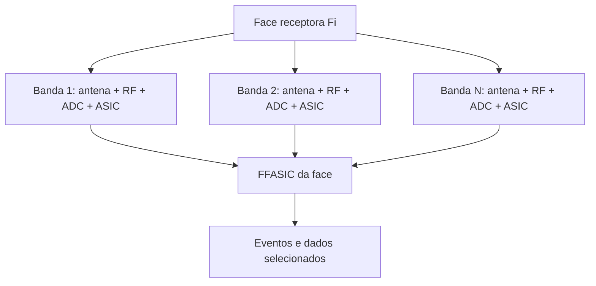
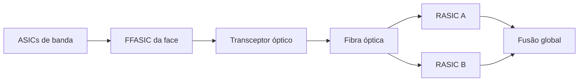

# RADOME V3 — Arquitetura Eletrônica Distribuída Revisada

## 8. Arquitetura multibanda de cada face

Cada uma das 60 faces do Radome V3 constitui uma unidade receptora multiespectral autônoma.

Uma face não utiliza uma única antena de banda larga para todo o espectro. Em vez disso, **cada banda espectral possui uma antena especificamente projetada para aquela faixa de frequências**, com geometria, polarização, ganho, diretividade e front-end próprios.

Assim, para uma face \(F_i\):

$$
F_i=
\left\{
B_{i,1},
B_{i,2},
\dots,
B_{i,N}
\right\},
$$

onde cada banda \(B_{i,j}\) constitui uma cadeia receptora praticamente independente.

Cada cadeia de banda contém:

$$
\boxed{
\text{Antena específica}
\rightarrow
\text{Front-End RF}
\rightarrow
\text{ADC}
\rightarrow
\text{ASIC de banda}
}
$$

Portanto, haverá pelo menos:

$$
60\times N_\text{bandas}
$$

antenas principais, e número correspondente de módulos de conversão e processamento, sem considerar canais adicionais destinados a polarização, arrays ou redundância.

Essa arquitetura expande o princípio multiespectral já previsto no Radome V2, que separava VHF, UHF e SHF/micro-ondas em antenas diferentes.

---

# 9. Unidade de aquisição de uma banda

Cada banda de cada face possui uma **Band Acquisition Unit — BAU**.

Uma BAU contém, no mínimo:

1. antena específica da banda;
2. pré-seletor;
3. LNA;
4. elementos de proteção e controle de ganho;
5. conversão de frequência, quando necessária;
6. ADC;
7. ASIC dedicado ao processamento daquela banda;
8. memória local de alta velocidade;
9. interface de sincronismo;
10. interface com o ASIC de fusão da face.

Sua cadeia funcional é:

$$
\text{Antena}_{i,j}
\rightarrow
\text{RF}_{i,j}
\rightarrow
ADC_{i,j}
\rightarrow
ASIC_{i,j}.
$$

O ADC e o ASIC constituem, portanto, um módulo de aquisição associado especificamente à banda.

Uma mudança de configuração em uma banda não interrompe necessariamente as demais.

---

# 10. Controle individual das bandas

O ASIC de cada banda não funciona apenas como detector.

Ele também controla dinamicamente o receptor.

Dependendo da arquitetura específica da banda, poderá controlar:

- frequência central observada;
- sub-banda de interesse;
- largura de banda instantânea;
- canais da PFB;
- filtros digitais;
- taxa de amostragem;
- decimação;
- ganho do receptor;
- AGC;
- atenuadores;
- limiares de trigger;
- integração temporal;
- resolução espectral;
- polarização selecionada;
- modos de varredura;
- captura contínua ou disparada;
- duração de pré-trigger;
- duração de pós-trigger;
- critérios de classificação de eventos.

Portanto, uma face pode dedicar simultaneamente diferentes bandas a diferentes regimes de observação.

Por exemplo:

$$
B_1\rightarrow \text{monitoramento contínuo}
$$

$$
B_2\rightarrow \text{varredura espectral}
$$

$$
B_3\rightarrow \text{frequência fixa de interesse}
$$

$$
B_4\rightarrow \text{captura acionada por outra face}.
$$

---

# 11. Timestamping centralmente referenciado

Todos os módulos A/D e ASICs do radome compartilham uma **referência temporal central comum**.

O núcleo temporal do radome fornece:

$$
f_\text{ref}
$$

e uma referência absoluta de época:

$$
T_\text{ref}.
$$

Cada ASIC de banda mantém relação determinística entre:

$$
\text{número da amostra}
$$

e

$$
\text{tempo absoluto}.
$$

Assim:

$$
t_{i,j,n}
=
T_\text{epoch}
+
\frac{n}{f_{s,i,j}}
+
\delta_{i,j},
$$

onde:

- \(i\) identifica a face;
- \(j\) identifica a banda;
- \(n\) identifica a amostra;
- \(f_{s,i,j}\) é sua taxa efetiva de amostragem;
- \(\delta_{i,j}\) representa a correção calibrada daquela cadeia.

O timestamp é, portanto, **centralmente referenciado**, porém associado aos dados diretamente no sistema local de aquisição.

Isso evita utilizar como referência temporal o instante de transmissão do pacote ou sua chegada ao núcleo.

---

# 12. Relógio atômico central

O radome possui um sistema temporal central baseado em referência atômica.

Esse sistema fornece uma base comum a todas as faces e bandas.

Sua função é garantir que eventos observados em diferentes posições do radome possam ser comparados diretamente:

$$
t_{1,a},
t_{17,c},
t_{42,b},
\dots
$$

pertencem à mesma escala temporal.

O sistema temporal será constantemente verificado, disciplinado e calibrado, incluindo:

- estabilidade do oscilador atômico;
- correção de deriva;
- comparação com referências externas quando disponíveis;
- medição dos atrasos da distribuição óptica;
- calibração dos clocks locais;
- calibração dos atrasos analógicos de cada cadeia RF.

A referência temporal central constitui, portanto, infraestrutura comum a todos os módulos do radome.

---

# 13. Processamento dentro do ASIC de banda

O fluxo bruto proveniente do ADC permanece local.

O ASIC de banda executa funções tais como:

$$
ADC
\rightarrow
DDC
\rightarrow
PFB
\rightarrow
FFT
\rightarrow
\text{Detector}
\rightarrow
\text{Features}.
$$

Dependendo da banda e da aplicação, poderá produzir:

- potência;
- espectro;
- frequência central;
- largura espectral;
- duração;
- SNR;
- fase;
- amplitude;
- polarização;
- impulsividade;
- periodicidade;
- persistência;
- modulação aparente;
- assinaturas espectrais;
- características estatísticas;
- correlações locais.

O resultado primário não é o fluxo completo do ADC.

É um conjunto de informações representativas de possíveis eventos.

---

# 14. Memória local e gravação dos sinais

Cada unidade de banda possui memória circular local.

Enquanto nenhuma informação relevante é identificada, os dados antigos são continuamente sobrescritos.

Um evento ocorrido em:

$$
t_0
$$

pode fazer o ASIC preservar:

$$
[t_0-T_\text{pre},
t_0+T_\text{post}].
$$

A janela preservada poderá conter, conforme o modo de operação:

- amostras ADC;
- I/Q;
- espectro complexo;
- FFTs sucessivas;
- dados após DDC;
- dados após channelizer;
- metadados completos da configuração do receptor.

Isso permite armazenar sinais para:

- análise posterior;
- classificação offline;
- treinamento de algoritmos;
- comparação entre eventos;
- estudo de sinais desconhecidos;
- reconstrução de fenômenos;
- perícia técnica;
- recalibração dos detectores.

A existência dessa gravação local significa que o radome não precisa decidir imediatamente se todos os dados brutos devem ser enviados.

---

# 15. Trigger local por banda

Cada ASIC de banda possui seus próprios detectores.

Quando identifica uma condição potencialmente relevante, gera um objeto:

$$
E_{i,j}
$$

contendo pelo menos:

$$
E_{i,j}=
\{
t,
f,
BW,
P,
SNR,
D,
C,
Q,
R
\},
$$

onde, por exemplo:

- \(t\): timestamp;
- \(f\): frequência ou faixa;
- \(BW\): largura de banda;
- \(P\): potência;
- \(SNR\): relação sinal/ruído;
- \(D\): duração;
- \(C\): classe preliminar;
- \(Q\): qualidade/confiança;
- \(R\): referência para os dados armazenados localmente.

Esse evento ainda **não precisa ser enviado diretamente ao núcleo central do radome**.

Primeiro ele é encaminhado ao ASIC de fusão da própria face.

---

# 16. ASIC Central da Face — Face Fusion ASIC

Cada uma das 60 faces possui um **ASIC central de fusão**, denominado:

$$
FFASIC_i.
$$

Assim:

$$
F_i
=
\{
ASIC_{i,1},
ASIC_{i,2},
\dots,
ASIC_{i,N}
\}
\rightarrow
FFASIC_i.
$$

Os ASICs das bandas enviam seus eventos e metadados ao FFASIC.

O FFASIC é responsável pela **fusão de dados dentro da face**.

---

# 17. Fusão local de informações

O FFASIC correlaciona eventos provenientes das diferentes bandas da mesma direção espacial.

Pode verificar, por exemplo:

$$
E_{i,1}(t_0),
E_{i,2}(t_0+\Delta t),
E_{i,5}(t_0+\Delta t').
$$

A coincidência de eventos entre diferentes receptores pode elevar significativamente sua relevância.

O FFASIC poderá utilizar:

- coincidência temporal;
- relação entre frequências;
- amplitude;
- polarização;
- duração;
- classificação;
- histórico;
- padrões conhecidos;
- comportamento multiespectral.

Assim, informações provenientes das várias antenas de uma mesma face são combinadas **antes de utilizar a rede óptica principal**.

---

# 18. Hierarquia de detecção

O Radome V3 passa a possuir três níveis de inteligência:

### Nível 1 — ASIC de banda

Responde:

$$
\boxed{\text{“Há algo interessante nesta banda?”}}
$$

### Nível 2 — ASIC central da face

Responde:

$$
\boxed{\text{“O conjunto das bandas desta direção indica um evento relevante?”}}
$$

### Nível 3 — ASIC central redundante do radome

Responde:

$$
\boxed{\text{“As diferentes direções do radome observam um mesmo fenômeno?”}}
$$

Essa arquitetura impede que todos os sinais adquiridos em todas as bandas cheguem indiscriminadamente ao núcleo.

---

# 19. Filtragem no ASIC central da face

O FFASIC executa uma segunda etapa de redução de dados.

Eventos considerados irrelevantes podem permanecer apenas em memória local ou ser descartados após determinado período.

Eventos relevantes são convertidos em um **Face Event Packet — FEP**.

Um FEP pode conter:

- identificação da face;
- identificação das bandas envolvidas;
- timestamp comum;
- timestamps individuais;
- frequência ou conjunto de frequências;
- largura de banda;
- potência;
- SNR;
- polarização;
- duração;
- classe;
- grau de confiança;
- flags;
- resumo espectral;
- referências aos buffers locais;
- estado das cadeias receptoras;
- parâmetros utilizados na aquisição.

O núcleo recebe predominantemente esses pacotes.

---

# 20. Controle das bandas pelo ASIC da face

A relação entre FFASIC e ASICs de banda é bidirecional.

O FFASIC não apenas recebe eventos.

Ele também pode comandar:

$$
FFASIC_i
\rightarrow
ASIC_{i,j}.
$$

Entre os comandos possíveis estão:

- mudar a frequência monitorada;
- alterar largura de banda;
- modificar threshold;
- iniciar gravação;
- interromper gravação;
- preservar buffer;
- ampliar pré/pós-trigger;
- mudar resolução espectral;
- selecionar outro modo de detecção;
- iniciar varredura;
- fixar acompanhamento em determinado sinal;
- aumentar taxa de amostragem;
- reduzir taxa de amostragem;
- solicitar dados I/Q;
- iniciar calibração.

Uma detecção em uma banda pode, portanto, modificar instantaneamente o comportamento das demais bandas daquela face.

---

# 21. Trigger cruzado dentro da face

Considere que a banda \(B_3\) detecte um transiente.

O fluxo pode ser:

$$
ASIC_{i,3}
\rightarrow
FFASIC_i.
$$

O FFASIC imediatamente ordena:

$$
ASIC_{i,1}\rightarrow FREEZE(t_0)
$$

$$
ASIC_{i,2}\rightarrow FREEZE(t_0)
$$

$$
ASIC_{i,4}\rightarrow FREEZE(t_0).
$$

Consequentemente, mesmo receptores que não tenham ultrapassado seus próprios thresholds preservam o sinal correspondente ao mesmo instante.

Esse recurso permite análise multiespectral posterior do mesmo fenômeno.

---

# 22. Rede óptica da face

Depois da fusão local, os pacotes são transmitidos pelo FFASIC através de **fibra óptica**.

A arquitetura fundamental é:

$$
\boxed{
\text{ASICs de banda}
}
$$

$$
\downarrow
$$

$$
\boxed{
FFASIC
}
$$

$$
\downarrow
$$

$$
\boxed{
Transceptor óptico
}
$$

$$
\downarrow
$$

$$
\boxed{
Fibra óptica
}
$$

$$
\downarrow
$$

$$
\boxed{
ASIC central do radome
}
$$

A utilização de fibra já fazia parte do princípio arquitetural do V2.

No V3, porém, ela assume uma função ainda mais clara: transportar **eventos já processados e dados selecionados**, em vez de carregar necessariamente o fluxo contínuo dos conversores.

---

# 23. ASIC central redundante do radome

Os pacotes provenientes dos 60 FFASICs convergem para o núcleo eletrônico do radome.

Esse núcleo possui um sistema de processamento central redundante.

A arquitetura lógica é:

$$
FFASIC_1
$$

$$
FFASIC_2
$$

$$
\vdots
$$

$$
FFASIC_{60}
$$

$$
\Downarrow\quad\text{fibra óptica}
$$

$$
\boxed{
RASIC_A
\parallel
RASIC_B
}
$$

onde \(RASIC_A\) e \(RASIC_B\) constituem o par redundante de ASICs centrais do radome.

Um poderá operar como principal e o outro como redundante quente, ou ambos poderão processar os eventos paralelamente e comparar os resultados.

---

# 24. Redundância da comunicação

Sempre que a implementação óptica permitir, os pacotes críticos poderão ser entregues aos dois processadores centrais:

$$
FEP
\rightarrow
RASIC_A
$$

e

$$
FEP
\rightarrow
RASIC_B.
$$

Dessa forma, uma falha de:

- ASIC central;
- transceptor;
- switch;
- caminho lógico;

não implica perda imediata da capacidade de detecção.

Eventos importantes deverão possuir:

- número sequencial;
- timestamp;
- Face ID;
- CRC;
- Event ID.

Isso permite identificar:

- perda;
- duplicação;
- corrupção;
- reordenação de pacotes.

---

# 25. Fusão global do radome

O RASIC recebe os eventos provenientes das 60 direções.

Se:

$$
E_i(t_i)
$$

e

$$
E_j(t_j)
$$

forem compatíveis, poderá determinar que pertencem ao mesmo fenômeno.

A fusão utilizará:

- timestamp;
- TDoA;
- diferenças de fase;
- frequência;
- polarização;
- potência;
- direção nominal das faces;
- classificações locais;
- correlação entre espectros.

Somente nesse nível ocorre a **fusão global do radome**.

---

# 26. Trigger reverso do núcleo

A arquitetura é bidirecional também entre o RASIC e as faces.

O núcleo pode determinar:

$$
RASIC
\rightarrow
FFASIC_i
\rightarrow
ASIC_{i,j}.
$$

Por exemplo:

$$
\boxed{
\text{FREEZE BUFFER}
}
$$

$$
\boxed{
\text{TRACK FREQUENCY}
}
$$

$$
\boxed{
\text{CHANGE BANDWIDTH}
}
$$

$$
\boxed{
\text{SEND RAW I/Q}
}
$$

$$
\boxed{
\text{RECORD}
}
$$

$$
\boxed{
\text{INCREASE RESOLUTION}
}
$$

$$
\boxed{
\text{SCAN RANGE}
}
$$

Assim, o próprio radome pode reconfigurar seus receptores em resposta a um evento.

---

# 27. Exemplo operacional

Considere um sinal inicialmente detectado na banda 4 da face 23.

### Etapa 1

$$
A_{23,4}
\rightarrow ADC_{23,4}
\rightarrow ASIC_{23,4}.
$$

O ASIC identifica uma anomalia em:

$$
t=t_0.
$$

### Etapa 2

Ele preserva os dados locais e envia:

$$
E_{23,4}(t_0)
$$

ao:

$$
FFASIC_{23}.
$$

### Etapa 3

O FFASIC verifica as demais bandas.

Encontra uma assinatura fraca também nas bandas 2 e 5.

Produz:

$$
FEP_{23}(t_0).
$$

### Etapa 4

O pacote atravessa a fibra:

$$
FFASIC_{23}
\rightarrow
RASIC.
$$

### Etapa 5

O RASIC verifica as demais faces e encontra eventos temporalmente compatíveis nas faces 22, 24 e 41.

### Etapa 6

O núcleo envia comandos para preservar:

$$
[t_0-\Delta t,t_0+\Delta t]
$$

nos buffers das faces relevantes.

### Etapa 7

Ordena aos receptores mais adequados:

$$
\text{TRACK}(f_0)
$$

e solicita dados I/Q somente das cadeias necessárias.

O enorme fluxo bruto existente dentro de centenas de ADCs nunca precisou atravessar continuamente a rede.

---

# 28. Arquitetura completa revisada

A arquitetura eletrônica fundamental do Radome V3 passa a ser:

$$
\boxed{
\text{ANTENA ESPECÍFICA}_{i,j}
}
$$

$$
\downarrow
$$

$$
\boxed{
\text{FRONT-END RF}_{i,j}
}
$$

$$
\downarrow
$$

$$
\boxed{
ADC_{i,j}
}
$$

$$
\downarrow
$$

$$
\boxed{
ASIC_{i,j}
}
$$

$$
\downarrow
$$

$$
\boxed{
\text{BUFFER}_{i,j}
}
$$

$$
\downarrow
$$

$$
\boxed{
FFASIC_i
}
$$

$$
\Downarrow\quad\text{FIBRA ÓPTICA}
$$

$$
\boxed{
RASIC_A\parallel RASIC_B
}
$$

$$
\downarrow
$$

$$
\boxed{
\text{FUSÃO GLOBAL}
}
$$

$$
\downarrow
$$

$$
\boxed{
\text{ARMAZENAMENTO / COMPUTADOR CENTRAL}
}
$$

---

# 29. Hierarquia quantitativa

Se existirem \(N_B\) bandas em cada face:

$$
N_\text{antenas}
=
60N_B
$$

e, no caso mínimo de uma cadeia por banda:

$$
N_\text{ADC}
=
60N_B,
$$

$$
N_\text{ASIC-banda}
=
60N_B.
$$

Além disso existem:

$$
60\ FFASIC
$$

e pelo menos:

$$
2\ RASIC
$$

para redundância central.

Por exemplo, para:

$$
N_B=8,
$$

o sistema possuiria pelo menos:

$$
480\ \text{antenas específicas},
$$

$$
480\ \text{cadeias ADC},
$$

$$
480\ \text{processadores de banda},
$$

$$
60\ \text{processadores de fusão local},
$$

e

$$
2\ \text{processadores centrais redundantes}.
$$

Esse número poderá ser ainda maior quando determinada banda utilizar duas polarizações ou arrays de múltiplos elementos.

---

# 30. Princípio de processamento do Radome V3

A arquitetura completa pode ser resumida por três reduções sucessivas de informação.

### Aquisição

$$
\boxed{\text{Sinal RF bruto}}
$$

é adquirido de forma maciçamente paralela.

### Fusão por face

$$
\boxed{\text{ASICs das bandas}}
\rightarrow
\boxed{\text{FFASIC}}
$$

transforma centenas de milhões ou bilhões de amostras por segundo em eventos multiespectrais relevantes.

### Fusão global

$$
\boxed{\text{60 FFASICs}}
\rightarrow
\boxed{\text{RASIC redundante}}
$$

correlaciona os eventos no espaço e no tempo.

Portanto, o princípio correto não é:

$$
\text{ADC}\rightarrow\text{fibra}\rightarrow\text{servidor}.
$$

É:

$$
\boxed{
\text{RF}
\rightarrow
\text{ADC}
\rightarrow
\text{ASIC de banda}
\rightarrow
\text{fusão da face}
\rightarrow
\text{fibra}
\rightarrow
\text{fusão do radome}
}
$$

com armazenamento distribuído dos sinais brutos para recuperação posterior.

---

# 31. Princípio central atualizado

O Radome V3 não é apenas um conjunto de receptores ligados a um computador central.

Ele constitui uma **arquitetura hierárquica de sensoriamento distribuído**.

Cada banda pergunta:

$$
\boxed{\text{“Existe um evento nesta parte do espectro?”}}
$$

Cada face pergunta:

$$
\boxed{\text{“As diferentes bandas indicam que há algo relevante nesta direção?”}}
$$

O núcleo do radome pergunta:

$$
\boxed{\text{“As diferentes direções estão observando o mesmo fenômeno?”}}
$$

Somente então são recuperados os sinais brutos necessários à análise detalhada.

Consequentemente, a quantidade de informação transportada pela fibra é determinada principalmente pela **informação útil produzida pelo sistema**, e não pela soma das taxas de amostragem de todos os seus conversores.

Esse é o princípio eletrônico e computacional fundamental do **Radome V3**.