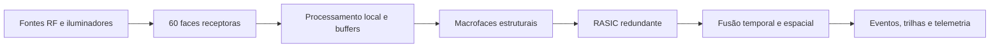
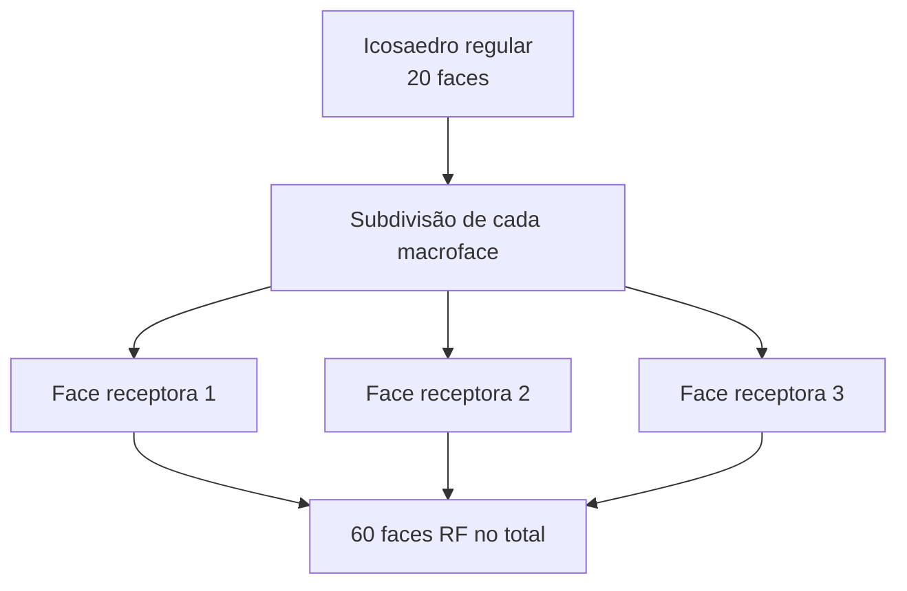
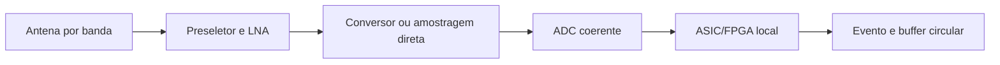

# RADOME V3  
## Radome Geodésico Multiespectro de 60 Faces com Aquisição Distribuída, Detecção Local e Referência Temporal Atômica

**Versão conceitual:** 3.0  
**Estado:** arquitetura de engenharia para dimensionamento, simulação eletromagnética, térmica e estrutural.

---

## 1. Objetivo do sistema

O Radome V3 é um sistema distribuído de recepção multiespectral destinado à detecção, caracterização espacial e correlação temporal de sinais de radiofrequência provenientes de praticamente qualquer direção do espaço observável.

A arquitetura mantém os princípios fundamentais definidos no Radome V2:

- múltiplas células receptoras independentes;
- cobertura multiespectral;
- processamento de RF diretamente próximo às antenas;
- FFT e processamento na borda;
- comunicação óptica entre as faces e o núcleo central;
- isolamento eletromagnético entre setores;
- fusão central dos eventos;
- operação em ambiente de montanha e condições meteorológicas severas.

Esses elementos estavam presentes na especificação anterior, que previa 60 células independentes, processamento local e concentração dos resultados por fibra óptica.

O V3, entretanto, faz quatro mudanças fundamentais:

1. torna a geometria das 60 faces matematicamente consistente;
2. separa **face receptora**, **macroface estrutural** e **célula RF interna**;
3. substitui o conceito de streaming permanente dos ADCs por **processamento distribuído orientado a eventos**;
4. introduz formalmente uma arquitetura de sincronização baseada em **referência atômica central, timestamping por hardware e calibração contínua dos atrasos dos canais**.

---

# 2. Geometria fundamental

## 2.1 Estrutura topológica

O V3 parte de um icosaedro regular.

Um icosaedro possui:

$$
V_0=12,\qquad
E_0=30,\qquad
F_0=20.
$$

Cada uma das 20 faces triangulares originais é subdividida em três faces.

Para uma macroface definida pelos vértices

$$
\mathbf v_1,\mathbf v_2,\mathbf v_3,
$$

define-se um novo vértice radial:

$$
\mathbf c=
R
\frac{
\mathbf v_1+\mathbf v_2+\mathbf v_3
}{
\left\|\mathbf v_1+\mathbf v_2+\mathbf v_3\right\|
}.
$$

A antiga face é então substituída pelas três faces:

$$
(\mathbf v_1,\mathbf v_2,\mathbf c),
$$

$$
(\mathbf v_2,\mathbf v_3,\mathbf c),
$$

$$
(\mathbf v_3,\mathbf v_1,\mathbf c).
$$

Portanto,

$$
20\times3=60
$$

faces receptoras.

Essa construção elimina a inconsistência existente no V2, no qual inicialmente se falava em 20 pirâmides produzindo 60 faces, mas posteriormente as 60 faces passavam a ser tratadas como 60 pirâmides independentes.

No V3 existem:

$$
V=12+20=32
$$

vértices,

$$
E=30+60=90
$$

arestas e

$$
F=60
$$

faces.

A consistência topológica pode ser verificada diretamente pela relação de Euler:

$$
V-E+F
=
32-90+60
=
2.
$$

Portanto, trata-se de uma superfície poliédrica fechada e geometricamente consistente.

A malha resultante pode ser descrita como uma **malha triakis-icosaédrica parametrizada de 60 faces**.

---

# 3. Envelope esférico

O V3 preserva aproximadamente o envelope dimensional do V2:

$$
R=3,1445\text{ m}
$$

e portanto:

$$
D=2R
=
6,2890\text{ m}.
$$

Mas há uma correção importante:

**6,289 m é o diâmetro total do envelope espacial.**

Consequentemente, uma estrutura fechada possui também aproximadamente:

$$
H=6,289\text{ m}.
$$

O valor de 3,1445 m corresponde ao **raio**, não à altura de uma estrutura contendo as 60 faces.

O V3 deixa, portanto, de chamar a estrutura de “hemisfério perfeito”.

Se posteriormente for necessária uma construção exclusivamente hemisférica apoiada diretamente sobre uma laje, ela deverá constituir uma variante geométrica específica, denominada, por exemplo, **V3-H60**, e não simplesmente a metade deste modelo.

---

# 4. Dimensões das 60 faces

Adotando:

$$
R=3,1445\text{ m},
$$

a aresta entre dois vértices originais do icosaedro passa a ser aproximadamente:

$$
L_b=3,3063\text{ m}.
$$

As novas arestas que ligam o centro radializado da macroface aos vértices originais possuem aproximadamente:

$$
L_s=2,0152\text{ m}.
$$

Portanto, cada uma das 60 faces é um triângulo isósceles aproximadamente:

$$
2,015\text{ m}\times
2,015\text{ m}\times
3,306\text{ m}.
$$

Isso é especialmente conveniente porque preserva a dimensão característica de aproximadamente **2 metros** utilizada no projeto anterior, sem exigir pirâmides tetraédricas extremamente salientes.

A área plana correspondente a cada abertura estrutural é aproximadamente:

$$
A_p\approx1,905\text{ m}^2.
$$

A área estrutural plana total é:

$$
A_{60}\approx114,3\text{ m}^2.
$$

Caso o painel externo seja moldado seguindo exatamente a superfície esférica de raio \(R\), cada setor ocupa aproximadamente:

$$
A_s=
\frac{4\pi R^2}{60}
\approx2,071\text{ m}^2.
$$

---

# 5. Casco externo e estrutura interna

A estrutura possui duas geometrias sobrepostas.

### Estrutura mecânica

O esqueleto segue as 90 arestas da malha triakis-icosaédrica.

As 20 macrofaces originais formam 20 módulos estruturais.

Cada macroface contém exatamente três faces receptoras:

$$
20\ \text{macrofaces}
\times
3\ \text{faces RF}
=
60\ \text{faces RF}.
$$

### Superfície aerodinâmica

Os painéis externos não precisam ser planos.

Cada abertura pode receber um painel PRFV ligeiramente curvo, moldado segundo:

$$
x^2+y^2+z^2=R^2.
$$

Dessa forma, o esqueleto continua sendo geodésico e triangulado, enquanto o envelope meteorológico aproxima-se muito mais de uma esfera contínua.

Isso restaura uma das vantagens pretendidas no V2 — redução das cargas aerodinâmicas — sem exigir que as cavidades RF determinem a geometria exterior.

---

# 6. As 60 células RF

Cada face externa corresponde a **uma célula RF independente**.

Entretanto, a célula deixa de ser uma pirâmide cuja ponta converge para o centro do radome.

Isso inviabilizaria o volume central.

No V3 cada célula é um **tronco piramidal radial**.

Se o raio externo é \(R_o\), define-se uma superfície interna:

$$
R_i=kR_o,
$$

onde, preliminarmente,

$$
0,50\le k\le0,65.
$$

Como referência inicial pode-se utilizar:

$$
k\approx0,55.
$$

Assim:

$$
R_i\approx1,73\text{ m}.
$$

Cada face externa e sua correspondente face interna são geometricamente semelhantes.

As paredes laterais convergem radialmente, mas são interrompidas antes de chegar ao centro.

O resultado são:

**60 setores RF blindados + uma cavidade central livre.**

A cavidade central passa a comportar:

- relógio atômico;
- sistema mestre de sincronismo;
- switches ópticos;
- processadores de correlação;
- servidores;
- armazenamento;
- distribuição de energia;
- refrigeração;
- interfaces externas.

---

# 7. Sobreposição angular

As 60 células são setores de processamento, e não regiões eletromagnéticas matematicamente isoladas.

Os diagramas das antenas deverão apresentar deliberadamente certa sobreposição entre células vizinhas.

Cada face possui três vizinhas diretas.

Essa propriedade permite:

- confirmação espacial de eventos;
- calibração entre células;
- interpolação angular;
- determinação de direção;
- rejeição de falsos positivos;
- processamento interferométrico.

A fronteira entre células é, portanto, uma fronteira **mecânica e computacional**, não uma fronteira rígida do campo eletromagnético.

---

# 8. Arquitetura multiespectral de cada face

O V2 previa VHF, UHF e SHF/micro-ondas em profundidades diferentes da célula.

O V3 preserva o conceito, mas transforma cada face em uma unidade multicanal.

Uma configuração inicial é:

$$
3\ \text{faixas espectrais}
\times
2\ \text{polarizações}
=
6\ \text{cadeias de aquisição por face}.
$$

Isso não constitui um limite.

Arrays de micro-ondas ou ondas milimétricas poderão utilizar significativamente mais canais.

A estrutura lógica mínima passa a ser:

$$
\text{Antena}
\rightarrow
\text{Pré-seletor}
\rightarrow
\text{LNA}
\rightarrow
\text{Atenuador/AGC}
\rightarrow
\text{Conversão, se necessária}
\rightarrow
ADC
\rightarrow
ASIC/FPGA.
$$

Portanto, **não existe apenas um ADC e um ASIC por face**.

Existem múltiplas cadeias simultâneas e independentes de conversão e processamento.

---

# 9. Face Processing Unit — FPU

Cada uma das 60 faces contém uma **Face Processing Unit**.

A FPU é responsável por todos os dados provenientes daquela direção.

Sua arquitetura inclui:

$$
N_\text{ADC}\geq 2
$$

e, na configuração multiespectral completa, potencialmente:

$$
N_\text{ADC}=6,\ 8,\ 12,\ldots
$$

dependendo da quantidade de bandas, polarizações e elementos de array.

Cada ADC poderá ter seu próprio ASIC dedicado ou compartilhar um ASIC/FPGA de grande capacidade com outros conversores.

A arquitetura deve ser modular.

---

# 10. Processamento local

O FPGA/ASIC não executa simplesmente uma FFT.

Cada canal realiza uma cadeia semelhante a:

$$
ADC
\rightarrow
DDC
\rightarrow
PFB
\rightarrow
FFT
\rightarrow
detecção
\rightarrow
extração de características.
$$

Dependendo do tipo de sinal, o ASIC poderá calcular localmente:

- potência por banda;
- espectro;
- SNR;
- ocupação espectral;
- impulsividade;
- persistência;
- largura de banda;
- frequência central;
- modulação aparente;
- polarização;
- correlação entre canais da própria face;
- classificação preliminar;
- probabilidade de o evento ser relevante.

A decisão inicial ocorre na própria face.

---

# 11. Memória circular de RF

Cada FPU mantém continuamente um **ring buffer** de dados brutos.

Isso permite que a face processe o fluxo em tempo real sem transmitir permanentemente as amostras.

Para cada canal:

$$
M_i=
\frac{
f_{s,i}b_iT_b
}{8},
$$

onde:

- \(f_s\) = taxa de amostragem;
- \(b\) = número de bits;
- \(T_b\) = tempo armazenado no buffer.

Para toda a face:

$$
M_\text{face}
=
\sum_iM_i.
$$

Exemplo meramente dimensional:

se seis canais produzissem simultaneamente

$$
1\text{ GS/s}\times12\text{ bits}
$$

e fossem mantidos durante:

$$
T_b=100\text{ ms},
$$

seriam necessários aproximadamente:

$$
M_\text{face}
=
0,9\text{ GB}.
$$

Buffers DDR/HBM da ordem de vários gigabytes permitem, portanto, preservar janelas significativas sem enviar o fluxo continuamente ao núcleo.

---

# 12. Evento e pré-trigger

Ao detectar um evento em:

$$
t_0,
$$

a face preserva no buffer uma janela:

$$
[t_0-T_\text{pre},
t_0+T_\text{post}].
$$

O material bruto não é imediatamente transmitido.

Inicialmente é criado um **Event Descriptor**.

Ele contém, por exemplo:

- Face ID;
- ADC/Channel ID;
- banda;
- polarização;
- timestamp;
- frequência central;
- largura de banda;
- duração;
- potência;
- SNR;
- bins espectrais relevantes;
- vetor reduzido de características;
- classe preliminar;
- confiança;
- checksum;
- referência para o bloco bruto armazenado localmente.

Esse pacote é muitas ordens de grandeza menor do que as amostras que o originaram.

---

# 13. Nova interpretação da largura de banda

Consequentemente, não é correto dimensionar o tráfego operacional fazendo simplesmente:

$$
60\times N_\text{ADC}\times f_s\times N_\text{bits}.
$$

Esse número representa a **capacidade interna de aquisição**, não a demanda permanente da rede óptica.

O tráfego normal é aproximadamente:

$$
R_\text{rede}
=
R_\text{alertas}
+
R_\text{telemetria}
+
R_\text{resumos espectrais}
+
R_\text{capturas solicitadas}.
$$

Sendo:

$$
R_\text{alertas}
=
\lambda
B_\text{evento},
$$

onde \(\lambda\) é a taxa de eventos.

Por exemplo, mesmo que uma face produzisse:

$$
200\ \text{eventos/s}
$$

com descritores relativamente grandes de:

$$
2\text{ kB},
$$

o tráfego seria:

$$
200\times2\,000\times8
=
3,2\text{ Mbit/s}.
$$

Para 60 faces:

$$
192\text{ Mbit/s}.
$$

Mesmo um cenário muito mais agressivo de:

$$
1\,000\ \text{eventos/s/face}
$$

com:

$$
4\text{ kB/evento}
$$

corresponderia a aproximadamente:

$$
32\text{ Mbit/s por face}
$$

ou:

$$
1,92\text{ Gbit/s}
$$

para todo o radome.

Portanto, um sistema óptico de 10 ou 25 Gb/s por face oferece enorme margem para alertas e telemetria.

Sua função adicional passa a ser permitir a transferência de **bursts de dados brutos sob demanda**.

---

# 14. Trigger distribuído

O núcleo central não precisa receber as amostras antes de decidir se um fenômeno é importante.

O fluxo correto é:

$$
\text{RF}
\rightarrow
\text{detecção local}
\rightarrow
\text{timestamp}
\rightarrow
\text{alerta}.
$$

Quando o computador central recebe um evento relevante da face \(F_i\), ele procura eventos temporalmente compatíveis nas faces vizinhas.

Se necessário, envia:

$$
\text{FREEZE}(t_0-\Delta t_1,\ t_0+\Delta t_2)
$$

para outras FPUs.

Essas unidades preservam seus respectivos buffers referentes ao **mesmo tempo absoluto**, ainda que não tenham inicialmente classificado o sinal como evento.

Esse mecanismo permite recuperar sinais abaixo do threshold local depois que outra face identifica o fenômeno.

---

# 15. Separação entre tempo do evento e tempo de transporte

O instante usado na correlação nunca será:

> “momento em que o pacote chegou ao servidor”.

O evento será definido pelo instante físico da amostragem:

$$
t_\text{evento}.
$$

Assim:

$$
t_\text{evento}
\neq
t_\text{recepção do pacote}.
$$

A rede pode introduzir latência variável sem destruir a informação espacial.

O requisito fundamental passa a ser a precisão do timestamp e não a latência absoluta da Ethernet.

---

# 16. Núcleo temporal atômico

O centro do Radome V3 contém um **Atomic Timing Core — ATC**.

O ATC possui como referência primária um oscilador atômico, preferencialmente rubídio de elevada estabilidade ou sistema de desempenho superior quando necessário.

Ele produz pelo menos:

$$
10\text{ MHz}
$$

e

$$
1PPS.
$$

Sistemas comerciais de referência de rubídio fornecem precisamente saídas como 10 MHz e 1 PPS e podem disciplinar a referência usando um 1 PPS externo.

---

# 17. Recalibração constante do relógio

A recalibração deve ser feita em três níveis diferentes.

### Nível 1 — estabilidade atômica local

O oscilador de rubídio fornece estabilidade de curto e médio prazo.

### Nível 2 — disciplina absoluta

Quando disponível e considerado confiável, um receptor GNSS multiconstelação fornece a referência absoluta.

O relógio atômico não deve sofrer correções abruptas.

Uma malha lenta de disciplining corrige progressivamente:

$$
\Delta f
$$

e

$$
\Delta t.
$$

Osciladores atômicos de rubídio podem justamente combinar estabilidade local com correção de longo prazo através de 1 PPS externo.

Em perda de GNSS, o sistema entra em:

$$
\text{ATOMIC HOLDOVER}.
$$

---

# 18. Distribuição do tempo às 60 faces

A referência central é distribuída pelas mesmas rotas ópticas ou por fibras dedicadas de sincronismo.

Uma arquitetura particularmente apropriada é baseada em princípios do **White Rabbit**, combinando PTP, Synchronous Ethernet e timestamping em hardware.

White Rabbit foi desenvolvido precisamente para distribuir tempo e frequência por fibra com sincronização inferior a um nanossegundo; resultados publicados pelo CERN demonstram precisão sub-nanosegundo e precisão temporal de dezenas de picosegundos em condições controladas.

A hierarquia passa a ser:

$$
\text{Atomic Clock}
\rightarrow
\text{Timing Grandmaster}
\rightarrow
\text{fibra}
\rightarrow
\text{FPU}
\rightarrow
\text{Clock Cleaner/PLL}
\rightarrow
ADC/ASIC.
$$

---

# 19. Sincronização dos ADCs

Distribuir 1 PPS não é suficiente.

Os próprios clocks de aquisição precisam possuir uma relação de fase conhecida.

Para interfaces JESD204 compatíveis, sinais como SYSREF permitem estabelecer latência determinística e alinhamento entre múltiplos conversores. A sincronização multichip exige que referência, clock e latências sejam considerados conjuntamente.

Portanto cada FPU recebe:

- referência de frequência;
- referência absoluta de tempo;
- evento de sincronização;
- identificador de época;
- parâmetros de calibração.

A cadeia passa a preservar a relação:

$$
\text{amostra }n
\longleftrightarrow
t_n.
$$

---

# 20. Timestamp por hardware

O timestamp deve ser gerado dentro da lógica próxima ao ADC, e não no sistema operacional.

Pode-se representar:

$$
t_n=
T_\text{epoch}
+
\frac{n}{f_s}
+
\delta_i,
$$

onde:

- \(T_\text{epoch}\) é o instante absoluto da época;
- \(n\) é o índice da amostra;
- \(f_s\) é o clock efetivo;
- \(\delta_i\) contém as correções calibradas daquele canal.

---

# 21. Calibração end-to-end

Mesmo relógios perfeitamente sincronizados não garantem TDoA correto.

Cada cadeia apresenta atraso:

$$
\tau_i(f,T)
$$

dependente de:

- filtro;
- LNA;
- mixer;
- ADC;
- cabos;
- temperatura;
- frequência;
- FPGA/ASIC.

O sistema V3 deve possuir uma rede interna de calibração.

Um pulso ou sinal conhecido é injetado periodicamente nos receptores.

Mede-se:

$$
\tau_i(f,T)
$$

para cada canal.

O timestamp corrigido torna-se:

$$
t_i^\ast
=
t_i
-
\tau_i(f,T).
$$

Essa calibração será repetida automaticamente durante toda a operação.

Portanto existem duas ações distintas:

**disciplina contínua do relógio central**  
e  
**recalibração contínua dos atrasos dos canais**.

---

# 22. Correlação central e TDoA

Após receber alertas de múltiplas faces, o processador central calcula:

$$
\Delta t_{ij}
=
t_i^\ast-t_j^\ast.
$$

Conhecendo as coordenadas das antenas:

$$
\mathbf r_i,\mathbf r_j,
$$

a direção \(\hat{\mathbf s}\) satisfaz aproximadamente:

$$
c\Delta t_{ij}
=
(\mathbf r_i-\mathbf r_j)
\cdot
\hat{\mathbf s}.
$$

Com muitas faces simultaneamente disponíveis, o problema torna-se sobredeterminado e pode ser resolvido por estimação robusta.

Além de TDoA, o sistema pode utilizar:

- diferença de fase;
- amplitude;
- polarização;
- padrão direcional das faces;
- frequência;
- classificação local.

---

# 23. Coerência entre múltiplas faces

A FFT local não deve descartar necessariamente a fase.

Para determinados modos de aquisição são preservados valores complexos:

$$
X_k=I_k+jQ_k.
$$

Assim o núcleo poderá utilizar:

$$
\phi_i-\phi_j
$$

além de:

$$
t_i-t_j.
$$

Isso permite modos interferométricos e formas de beamforming digital entre subconjuntos de faces.

---

# 24. Dois planos de comunicação

O V3 distingue dois planos.

## Control/Event Plane

Baixo volume e alta prioridade.

Transporta:

- alertas;
- timestamps;
- saúde do sistema;
- comandos;
- calibração;
- configuração;
- sincronização;
- metadados.

## Capture Plane

Alto volume, utilização esporádica.

Transporta:

- janelas I/Q;
- espectros completos;
- dumps de ADC;
- dados para calibração;
- diagnósticos.

O Capture Plane pode utilizar a capacidade restante dos links de 10/25 Gb/s ou uma malha óptica dedicada.

---

# 25. Arquitetura hierárquica

A estrutura física do sistema passa a possuir três níveis:

$$
60\ \text{Face Processing Units}
$$

agrupadas mecanicamente em:

$$
20\ \text{Macroface Service Nodes},
$$

cada um atendendo três faces, convergindo para:

$$
1\ \text{Central Timing and Fusion Core}.
$$

Um Macroface Service Node pode compartilhar entre suas três FPUs:

- alimentação;
- conversores DC/DC de primeiro estágio;
- fibras;
- refrigeração;
- monitoramento ambiental;
- controlador de manutenção.

Os caminhos analógicos das três faces permanecem isolados.

---

# 26. Blindagem eletromagnética

As antigas “60 pirâmides de cobre” do V2 são substituídas pelas paredes dos 60 setores radiais truncados.

O V2 previa cobre ou malha condutiva para impedir cross-talk.

No V3 a especificação não exige inicialmente chapas maciças de 0,5–1 mm.

A solução poderá utilizar:

- cobre laminado fino;
- tecido metálico;
- filme metalizado;
- alumínio;
- compósito condutivo;
- estruturas híbridas.

O requisito passa a ser eletromagnético:

$$
|S_{21}(f)|<S_\text{max}(f),
$$

medido entre células.

A espessura será uma consequência desse requisito e da robustez mecânica, não um valor arbitrário.

---

# 27. Antenas e janelas dielétricas

Cada uma das 60 faces funciona como uma janela de RF.

O PRFV do V2 permanece como candidato, mas sua espessura não será fixada simplesmente em 3–4 mm para todas as bandas.

A composição deverá ser otimizada em função de:

$$
\epsilon_r(f,T),
$$

$$
\tan\delta(f,T),
$$

$$
t,
$$

polarização e ângulo de incidência.

A mesma análise deverá considerar:

- água;
- chuva;
- neve;
- gelo;
- gel coat;
- adesivos;
- juntas;
- estrutura imediatamente atrás da janela.

---

# 28. Processamento local adaptativo

O threshold de alerta não deve ser fixo.

Cada FPU mantém um modelo local do ruído:

$$
N_i(f,t).
$$

O trigger pode utilizar:

$$
P_i(f,t)
>
N_i(f,t)+\Delta.
$$

Além da potência, podem ser empregados simultaneamente detectores de:

- transientes;
- mudança estatística;
- ocupação anômala;
- correlação entre polarizações;
- assinatura espectral;
- evento conhecido;
- evento desconhecido.

A rede central pode alterar dinamicamente a sensibilidade de determinadas faces.

---

# 29. Trigger cooperativo entre faces

Suponha que a face 17 detecte um evento em:

$$
t=t_0.
$$

Ela transmite:

$$
E_{17}(t_0).
$$

O servidor central verifica imediatamente as faces vizinhas e geometricamente compatíveis.

Mesmo que a face 18 tenha observado o fenômeno abaixo de seu threshold, o núcleo pode solicitar:

$$
\operatorname{READ}_{18}
(t_0-100\mu s,t_0+100\mu s).
$$

Dessa forma:

**a decisão de detecção é distribuída; a decisão de interpretação é coletiva.**

Esse é um dos princípios centrais do V3.

---

# 30. Armazenamento distribuído

As 60 faces passam também a constituir uma memória temporal distribuída.

Dados irrelevantes podem ser sobrescritos continuamente.

Eventos classificados como importantes recebem um ID global:

$$
EventID.
$$

Os buffers associados permanecem bloqueados até que o núcleo central determine:

$$
\text{DELETE},
$$

$$
\text{RETAIN},
$$

ou

$$
\text{TRANSFER}.
$$

Isso reduz drasticamente a exigência de transporte contínuo.

---

# 31. Arquitetura térmica revisada

A existência de múltiplos ADCs, ASICs, memórias e transceptores por face altera significativamente o orçamento térmico do V2.

Portanto, o antigo valor de 30–60 W por face não deve permanecer como requisito definitivo. O V2 estimava 1,8–3,6 kW para 60 faces.

No V3:

$$
P_\text{face}
=
P_\text{RF}
+
P_\text{ADC}
+
P_\text{ASIC}
+
P_\text{memory}
+
P_\text{optical}
+
P_\text{DC/DC}.
$$

E:

$$
P_\text{total}
=
60P_\text{face}
+
P_\text{central}.
$$

O orçamento térmico só será congelado após a definição efetiva dos conversores e ASICs.

---

# 32. Caminho térmico

O calor deve seguir deliberadamente:

$$
\text{ASIC/ADC}
\rightarrow
\text{cold plate}
\rightarrow
\text{estrutura condutiva}
\rightarrow
\text{sistema térmico}.
$$

Partes das paredes das células podem atuar como heat spreaders, desde que isso não prejudique a blindagem ou altere o comportamento das antenas.

O calor residual poderá ser conduzido para o casco para **auxiliar** na prevenção de gelo.

Entretanto, não se considera mais que a dissipação eletrônica, por si só, garanta o degelo.

---

# 33. Sistema de energia

Mantém-se como arquitetura de referência:

$$
48\text{ VDC}
$$

distribuído pelo radome.

Cada macroface recebe 48 V e realiza conversões locais.

A proximidade entre DC/DC e circuitos RF requer:

- filtros;
- blindagem;
- sincronização dos conversores quando conveniente;
- controle de EMI;
- aterramento definido.

O V2 já previa distribuição de 48 V com reguladores locais, princípio preservado no V3.

---

# 34. Núcleo central

O Central Timing and Fusion Core contém pelo menos os seguintes subsistemas:

$$
\boxed{\text{Atomic Timing Core}}
$$

$$
\boxed{\text{Optical Network Core}}
$$

$$
\boxed{\text{Event Correlator}}
$$

$$
\boxed{\text{Raw Capture Storage}}
$$

$$
\boxed{\text{Calibration Engine}}
$$

$$
\boxed{\text{Thermal Controller}}
$$

$$
\boxed{\text{Power Supervisor}}
$$

$$
\boxed{\text{External Data Gateway}}
$$

A arquitetura de fusão central prevista no V2 permanece válida conceitualmente, mas passa agora a trabalhar prioritariamente com eventos temporalmente coerentes, e não com 60 fluxos brutos permanentes.

---

# 35. Redundância temporal

Embora exista um relógio atômico central lógico, o sistema não deverá possuir um único ponto físico de falha.

A implementação recomendada possui:

$$
ATC_A
$$

e

$$
ATC_B.
$$

Um opera como referência ativa e o outro acompanha continuamente:

$$
\Delta t_{AB}
$$

e

$$
\Delta f_{AB}.
$$

O sistema registra também a discrepância entre referências GNSS, relógios atômicos e os clocks recuperados pelas faces.

Qualquer salto inesperado torna a fonte correspondente suspeita antes que ela contamine os timestamps.

---

# 36. SPDA

O princípio do V2 de utilizar captores externos e privilegiar fibra óptica permanece válido.

O projeto definitivo deverá separar:

- estrutura receptora RF;
- estrutura de captação de descargas;
- equipotencialização;
- proteção das entradas de energia;
- proteção dos cabos externos;
- aterramento do núcleo;
- zonas eletromagnéticas internas.

As fibras de dados e sincronismo são particularmente vantajosas porque não conduzem diretamente corrente de surto entre as células e o núcleo.

---

# 37. Organização espacial final

O Radome V3 pode ser visualizado radialmente como:

$$
\boxed{\text{ambiente externo}}
$$

$$
\downarrow
$$

$$
\boxed{\text{painel dielétrico esférico}}
$$

$$
\downarrow
$$

$$
\boxed{\text{antenas multibanda}}
$$

$$
\downarrow
$$

$$
\boxed{\text{front-end RF}}
$$

$$
\downarrow
$$

$$
\boxed{\text{múltiplos ADCs}}
$$

$$
\downarrow
$$

$$
\boxed{\text{ASIC/FPGA + buffer local}}
$$

$$
\downarrow
$$

$$
\boxed{\text{parede/septo RF}}
$$

$$
\downarrow
$$

$$
\boxed{\text{fibra + 48 V}}
$$

$$
\downarrow
$$

$$
\boxed{\text{núcleo central}}
$$

---

# 38. Unidade lógica fundamental

A unidade fundamental do V3 deixa, portanto, de ser:

$$
\text{uma pirâmide}.
$$

Passa a ser:

$$
\boxed{
\text{Face RF}
+
\text{FPU}
+
\text{timestamp}
+
\text{buffer}
}
$$

e existem exatamente:

$$
60
$$

dessas unidades.

Três unidades formam uma macroface estrutural.

---

# 39. Arquitetura funcional resumida

O fluxo completo de um evento é:

$$
\boxed{\text{onda RF}}
$$

$$
\downarrow
$$

$$
\boxed{\text{antena}}
$$

$$
\downarrow
$$

$$
\boxed{\text{front-end}}
$$

$$
\downarrow
$$

$$
\boxed{\text{ADC}_1,\text{ADC}_2,\ldots,\text{ADC}_N}
$$

$$
\downarrow
$$

$$
\boxed{\text{ASIC/FPGA}}
$$

$$
\downarrow
$$

$$
\boxed{\text{FFT/PFB/detector}}
$$

$$
\downarrow
$$

$$
\boxed{\text{timestamp atômico}}
$$

$$
\downarrow
$$

$$
\boxed{\text{Event Descriptor}}
$$

$$
\downarrow\text{ fibra}
$$

$$
\boxed{\text{correlador central}}
$$

$$
\downarrow
$$

$$
\boxed{\text{solicitação seletiva de I/Q}}
$$

$$
\downarrow
$$

$$
\boxed{\text{TDoA/fase/direção/classificação}}
$$

---

# 40. Consequência arquitetural principal

Essa arquitetura altera profundamente o problema de largura de banda.

A grandeza:

$$
\sum f_sN_\text{bits}
$$

define a capacidade computacional que deve existir **dentro das faces**.

Ela não define diretamente a capacidade necessária do backbone óptico.

A rede central deve ser dimensionada principalmente por:

$$
\text{taxa de eventos}
+
\text{capturas solicitadas}
+
\text{margem de diagnóstico}.
$$

Portanto, centenas de ADCs operando simultaneamente no radome são compatíveis com um backbone de capacidade muito menor que o fluxo bruto agregado, desde que:

1. o processamento local seja suficientemente poderoso;
2. exista memória circular próxima aos conversores;
3. os timestamps sejam confiáveis;
4. o núcleo possa recuperar seletivamente janelas de interesse.

---

# 41. Estado da especificação V3

Com essas alterações, o Radome V3 passa a possuir uma hierarquia geometricamente e computacionalmente consistente:

$$
\boxed{
20\ \text{macrofaces estruturais}
}
$$

$$
\boxed{
60\ \text{faces receptoras}
}
$$

$$
\boxed{
60\ \text{células RF radiais truncadas}
}
$$

$$
\boxed{
60\ \text{FPUs}
}
$$

$$
\boxed{
N\gg60\ \text{ADCs/ASICs}
}
$$

$$
\boxed{
1\ \text{tempo atômico comum}
}
$$

$$
\boxed{
1\ \text{sistema central de correlação}
}
$$

O resultado é uma arquitetura em que **a digitalização é massivamente paralela, mas a comunicação é seletiva**.

A informação que atravessa continuamente o radome não é o sinal bruto.

É principalmente:

$$
\boxed{
\text{“o que ocorreu, onde foi detectado e exatamente quando ocorreu”}
}
$$

e somente após essa primeira decisão o sistema recupera:

$$
\boxed{
\text{“as amostras necessárias para provar e caracterizar o evento”}.
}
$$

Esse passa a ser o princípio central do **Radome V3**.