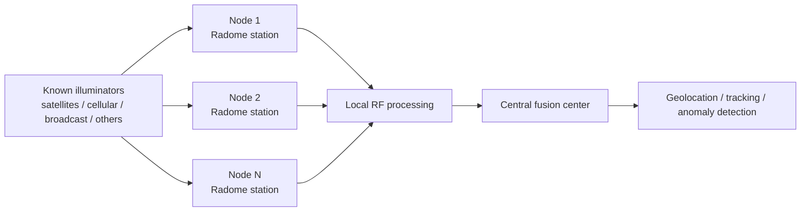
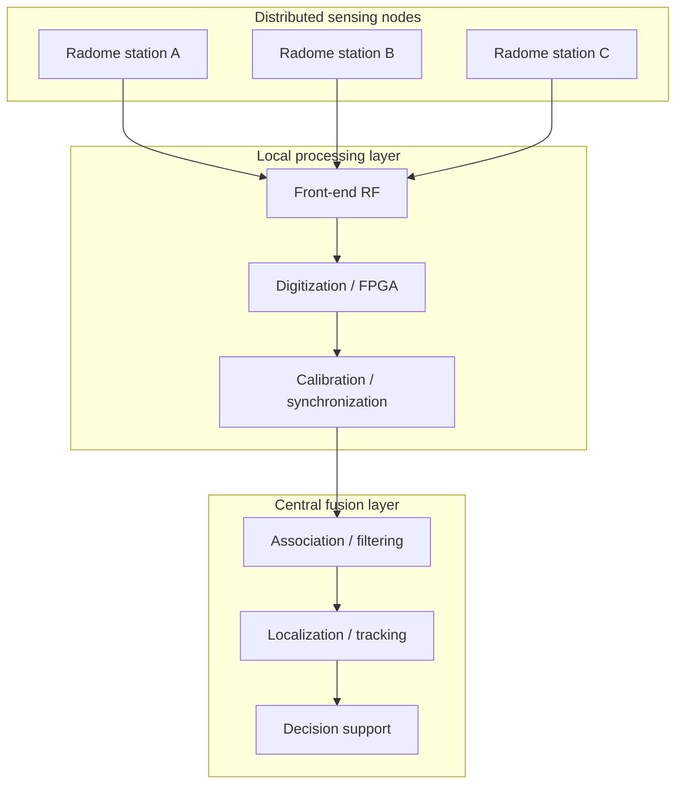
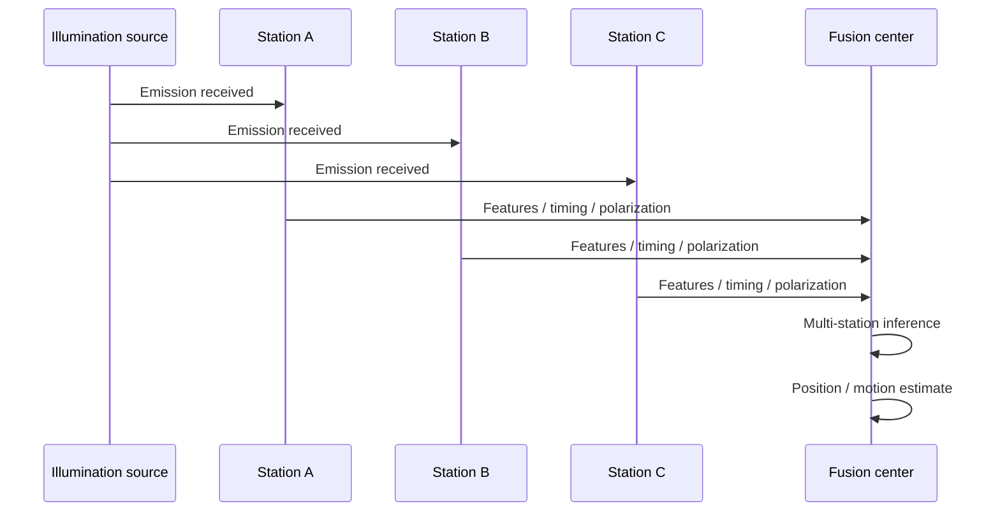

# RADOME — Geodetic Multiband Passive Electromagnetic Sensing Network

> **Startup context:** before working on this repository, read `AGENTS.md`, this `README.md`, `SUMARIO_E_ROADMAP.md` and `ROADMAP_CORRECOES.md`, in that order. The mandatory recovery protocol is defined in `AGENTS.md`.

## Overview

This repository consolidates a technical and scientific conception for a distributed network of geodesic radome-based sensing stations intended for passive electromagnetic surveillance, direction finding, and geolocation. The proposed architecture is designed for deployment in elevated mountain sites across Brazil, integrating multiband reception, precise time synchronization, local edge processing, and centralized fusion of observations.

The authoritative technical publications are `projeto/radome-pt-br.tex` and `projeto/radome-en.tex` (document version 1.1, architecture revision 3), compiled independently for Brazilian Portuguese and English. Quantitative values and their evidence status are controlled in `projeto/PARAMETERS.md`; architecture decisions are recorded in `projeto/DECISIONS.md`. Earlier documents remain historical inputs.

The system is intended to exploit opportunistic illumination from known external sources such as cellular towers, satellites, broadcast transmitters, and other RF emitters. By combining angle of arrival, time difference of arrival, frequency difference of arrival, Doppler information, and polarization measurements, the network can infer the position and motion of emitters or reflected targets without relying on active radar transmission.

---

## Mission Statement

The project addresses a strategic objective at the intersection of:

- passive radar and electronic surveillance;
- multiband antenna integration and conformal radome design;
- distributed sensing and networked geolocation;
- advanced signal processing and calibration;
- national defense, spectrum awareness, and resilient infrastructure.

The proposed concept is not limited to a single radome. It is a distributed sensing ecosystem in which multiple nodes cooperate to reconstruct the electromagnetic environment over wide spatial domains.

---

## Scientific and Technical Scope

The system concept includes:

- geodesic and conformal radome structures with multiple functional apertures;
- multiband reception spanning HF, VHF/UHF, L/S/C, and X/Ku/Ka domains;
- dual-polarized or vector-sensitive front ends;
- local acquisition, filtering, beamforming, and event-oriented processing;
- precise synchronization and continuous calibration across distributed nodes;
- centralized fusion for localization, tracking, and anomaly detection.

This repository gathers technical notes, architectural definitions, and a consolidated proposal derived from multiple source documents in the workspace.

---

## System Concept

The architecture operates as a passive multistatic observation network. Each station receives weak or indirect emissions, extracts informative features from the waveforms, and transfers selected measurements to a central processor for joint inference.

---

## Functional Architecture

This layered design separates local sensing functions from global inference tasks, allowing the system to be scaled progressively from a field demonstrator to a broader strategic network.

---

## Operational Scenario

In this mode, the network does not need to transmit active interrogation signals. It relies on ambient or opportunistic illumination and statistically fuses multiple observations into a robust estimate.

---

## Key Technical Themes

### 1. Passive multistatic sensing
The network is designed to infer target or emitter state from indirect observations rather than direct active illumination.

### 2. Multiband and polarimetric reception
The platform supports multiple spectral bands through independent RF chains. Circular, linear-vector or Stokes synthesis is permitted only for a calibrated same-band module with two simultaneous coherent orthogonal ports; the current VHF and UHF Yagis are independent single-polarization channels.

The combined VHF/UHF Yagi boom is collinear with the outward normal of its external triangular face. The transverse elements are mutually orthogonal and the complete crossed assembly is rotated by 45 degrees around that normal relative to the local tangent basis.

### 3. Distributed synchronization and calibration
Time and phase coherence are essential for high-quality TDOA/FDOA and beamforming-based inference. The concept explicitly includes hardware timestamping, optical distribution of timing, and local holdover strategies.

### 4. Edge processing and event-oriented operation
To reduce bandwidth and storage requirements, local nodes perform pre-processing, filtering, and buffering before sending selected data to the fusion center.

### 5. Resilience and deployment realism
The design must account for mountainous terrain, environmental variability, wind loading, humidity, thermal drift, EMI, and operational logistics.

---

## Repository Contents

This repository includes:

- technical notes and consolidated architectural descriptions;
- conceptual system diagrams;
- literature-based review material on radome systems, passive sensing, and electromagnetic surveillance;
- `geoespacial/`: formal subproject of the bilingual article for reproducible
  continental site selection, including source manifests, ignored raw GIS data,
  optimization code and future QGIS/Blender products; its governance and
  article-integration gate are defined in `geoespacial/SUBPROJETO.md`;
- a structured proposal suitable for further development into a formal technical report or engineering specification.

Relevant source materials in the repository include:

- [Projeto_Radomes_Multifaixa_Revisado.md](Projeto_Radomes_Multifaixa_Revisado.md)
- [RADOME V3.md](RADOME%20V3.md)
- [plano_diretor_complexo_vigilancia_alta_montanha.md](plano_diretor_complexo_vigilancia_alta_montanha.md)
- [radome_antenna_literature_review/review.md](radome_antenna_literature_review/review.md)
- [projeto_tecnico_radome_consolidado.md](projeto_tecnico_radome_consolidado.md)

---

## Expected Development Path

The concept can evolve through the following stages:

1. system-level simulation and coverage analysis;
2. prototyping of a small distributed demonstrator;
3. calibration and synchronization validation;
4. field trials with known emitters and controlled targets;
5. expansion toward a broader operational network.

---

## Scientific Positioning

This work sits at the convergence of several advanced domains:

- electromagnetics and radome engineering;
- adaptive RF signal processing;
- distributed sensing and networked estimation;
- passive surveillance and electronic intelligence;
- resilient infrastructure for strategic observation.

The project is best understood as a high-level technical platform for future research, prototyping, and system engineering rather than as a single-component antenna concept.

---

## Notes

The material in this repository is conceptual and should be validated through simulation, laboratory testing, and field experimentation before being used for operational deployment.
