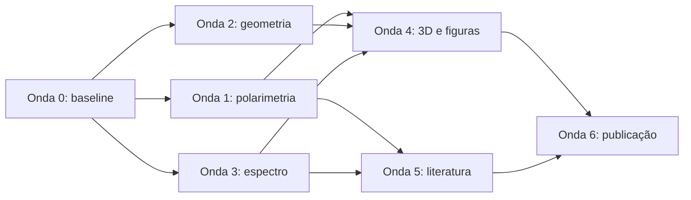

# RADOME — Roadmap de correções técnicas e documentais

**Data-base:** 8 de agosto de 2026
**Escopo:** inconsistências encontradas entre documentos, figuras, scripts, modelo Blender e revisão bibliográfica
**Regra:** nenhuma solução arquitetural deve ser apresentada como desempenho demonstrado antes do gate experimental correspondente.

## Estado dos gates

| Gate | Estado inicial | Resultado esperado |
|---|---|---|
| C0 — baseline documental | Aprovado com bloqueios | Fonte, versionamento, parâmetros e ADRs aprovados; conflitos seguem bloqueados para C1–C3 |
| C1 — polarimetria correta | Aprovado no nível arquitetural | Síntese restrita a duas portas coerentes na mesma faixa; Yagis VHF/UHF declaradas single-pol independentes |
| C2 — geometria consistente | Bloqueado | Malha, raio, faces, corte e base derivados de um modelo paramétrico único |
| C3 — cobertura espectral | Em aberto | Faixas sem lacunas acidentais e cadeia explícita para ADS-B 1090 MHz |
| C4 — modelo 3D sincronizado | Bloqueado por C2 | Blender e figuras gerados a partir dos parâmetros aprovados |
| C5 — consistência científica | Em aberto | Novidade, referências e limites formulados com evidência apropriada |
| C6 — qualidade editorial | Em aberto | Bilinguismo simétrico e compilação sem avisos relevantes |

## Onda 0 — congelar a baseline

**Prioridade:** imediata.
**Dependências:** nenhuma.

1. [x] Declarar `projeto/projetov1.tex` como documento técnico autoritativo e classificar os PDFs/Markdown anteriores como histórico.
2. [x] Resolver a nomenclatura “RADOME V1” versus “geometria V3”: adotar versão do documento e revisão da arquitetura como campos distintos.
3. [x] Criar uma tabela central de parâmetros com valor, unidade, estado (`proposto`, `derivado`, `simulado`, `medido`, `histórico` ou `em conflito`), fonte, responsabilidade e validação.
4. [x] Registrar decisões em um log curto de arquitetura, evitando que números retornem por cópia de documentos históricos.
5. [x] Realizar a revisão formal da baseline e aprovar as entradas iniciais com bloqueios explícitos em `projeto/PARAMETERS.md`.

**Gate C0:** todos os valores quantitativos do artigo apontam para a tabela central ou são marcados explicitamente como exemplo conceitual.

## Onda 1 — corrigir a polarimetria

**Prioridade:** crítica.
**Dependências:** C0.

1. [x] Remover a síntese RHCP/LHCP e Stokes feita pela combinação da Yagi VHF com a Yagi UHF: elas observam faixas diferentes.
2. [x] Decidir, por faixa, entre:
   - antena dual-polarizada com duas portas coerentes na mesma frequência;
   - par de antenas ortogonais da mesma faixa;
   - recepção de polarização única, explicitamente limitada.
3. [x] Manter as Yagis VHF/UHF cruzadas apenas como integração mecânica, diversidade espectral e diversidade de orientação avaliada separadamente.
4. [x] Atualizar `04_multiband_polarimetry.tex`, `09_literature_review.tex`, `10_conclusion.tex`, `fig05_polarimetria.png` e seu gerador.
5. [x] Definir como evidência obrigatória amplitude, fase, isolamento, cross-pol, matriz de Jones e deriva por frequência, ângulo e temperatura.

**Gate C1:** toda equação polarimétrica recebe entradas simultâneas, coerentes e na mesma frequência; figura, texto e hardware proposto concordam.

## Onda 2 — reconstruir a geometria paramétrica

**Prioridade:** crítica.
**Dependências:** C0; pode ocorrer em paralelo com a Onda 1.

1. Definir formalmente o poliedro base e o método de subdivisão/projeção.
2. Separar aresta da macroface, dimensões das subfaces, raio circunscrito, diâmetro e altura do segmento cortado.
3. Recalcular `V`, `E` e `F` para o envelope fechado e para a estrutura efetivamente cortada.
4. Definir o corte em coordenada geométrica (`ângulo polar` ou `z/R`), evitando a ambiguidade de “latitude 35° S”.
5. Dimensionar o anel de apoio e compatibilizá-lo com a base de concreto; ampliar a base ou especificar uma transição estrutural.
6. Produzir verificação automática de Euler, comprimentos, raio do apoio e envelope da base.

**Gate C2:** um arquivo de parâmetros reproduz todas as dimensões publicadas e passa verificações geométricas e de apoio sem valores manuais conflitantes.

## Onda 3 — fechar o plano espectral e os experimentos

**Prioridade:** alta.
**Dependências:** C0 e decisão preliminar de C1.

1. Resolver as lacunas 300–470 MHz e 860 MHz–1 GHz como cobertura deliberadamente ausente ou como novas subfaixas.
2. Atribuir ADS-B 1090ES e UAT 978 MHz a antenas, filtros, ADCs e canais explícitos; não presumir que a Yagi de 470–860 MHz os cubra.
3. Separar três experimentos:
   - emissor direto cooperativo ADS-B;
   - transmissores conhecidos para calibração;
   - reflexão biestática de alvo com canal de referência e vigilância.
4. Definir largura instantânea, faixa dinâmica, NF, IP3, taxa de amostragem, clock e volume de dados de cada demonstrador.
5. Reavaliar a baseline nominal de 100 km por orçamento de enlace, horizonte, geometria e regulamentação do sítio.

**Gate C3:** cada frequência citada possui caminho de sinal completo e cada experimento possui observáveis, verdade-terreno, estimador e métrica separados.

## Onda 4 — sincronizar Blender, figuras e texto

**Prioridade:** alta.
**Dependências:** C1, C2 e C3.

1. Fazer o Blender consumir a geometria aprovada, incluindo raio, corte, malha, anel e base.
2. Corrigir o nome interno `4x4x2 m` ou as dimensões, mantendo uma única especificação.
3. Substituir a malha ilustrativa de anéis pela malha geodésica real, ou rotular inequivocamente o render como esquemático.
4. Gerar faces, suportes e antenas sem coordenadas independentes desenhadas manualmente.
5. Preservar a baseline `baseline_35S_concrete_base/` e criar uma nova baseline nomeada após aprovação.
6. Remover a repetição de `fig13_radome_blender.png` no artigo.

**Gate C4:** relatório automático compara parâmetros do artigo, script e `.blend`; renders e legendas descrevem a mesma configuração.

## Onda 5 — fortalecer literatura e alegações

**Prioridade:** média-alta.
**Dependências:** C1 e C3.

1. Trocar “inovação central” por “solução arquitetural proposta” até concluir busca de anterioridade específica para a montagem.
2. Auditar os 29 registros do Consensus em fontes primárias, acrescentando DOI, volume, páginas e estado editorial.
3. Verificar especialmente registros de 2025–2026 e os que possuem venue ou resumo incompletos.
4. Separar claramente revisão narrativa via Consensus de uma eventual revisão sistemática.
5. Criar matriz alegação–referência–evidência e marcar como hipótese tudo que ainda depende de simulação ou ensaio.

**Gate C5:** nenhuma alegação de novidade ou desempenho depende apenas do resultado do Consensus ou de um diagrama conceitual.

## Onda 6 — corrigir estrutura bilíngue e publicação

**Prioridade:** média.
**Dependências:** C1–C5 para evitar retrabalho.

1. Mover o parágrafo inglês atualmente inserido na seção portuguesa do capítulo 3.
2. Reestruturar a subseção de torres celulares do capítulo 7 em blocos English/Português equivalentes.
3. Comparar automaticamente presença de equações, figuras, ressalvas e números entre os dois idiomas.
4. Corrigir âncoras PDF duplicadas da página 1, a caixa `Overfull` do apêndice e quebras problemáticas da bibliografia.
5. Executar a sequência completa LaTeX e inspecionar o PDF final.

**Gate C6:** compilação final sem erros, referências indefinidas, âncoras duplicadas ou divergências técnicas entre idiomas.

## Ordem operacional

## Definição de concluído

As correções estarão concluídas quando os seis gates forem aprovados, o artigo bilíngue recompilar conforme `AGENTS.md`, as figuras forem regeneradas a partir da baseline correta e cada afirmação quantitativa estiver classificada como proposta, simulada ou medida.
