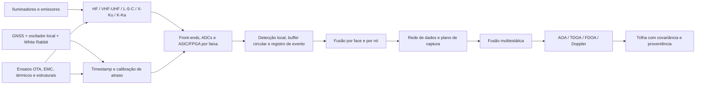

# RADOME — Sumário executivo e roadmap de pesquisa e engenharia

**Data de consolidação:** 8 de agosto de 2026
**Estado:** arquitetura conceitual; desempenho operacional ainda não demonstrado
**Documentos técnicos vigentes:** `projeto/radome-pt-br.tex` / `projeto/radome-pt-br.pdf` e `projeto/radome-en.tex` / `projeto/radome-en.pdf`

## 1. Síntese executiva

O RADOME propõe uma rede distribuída de estações passivas em sítios elevados para observar, caracterizar e localizar emissões eletromagnéticas. Cada nó combina uma estrutura geodésica, abertura híbrida multifaixa, recepção vetorial/polarimétrica, cadeias RF independentes, processamento local orientado a eventos, sincronização e calibração ponta a ponta. A fusão de múltiplos nós emprega AOA, TDOA e FDOA e, em cenários de radar passivo, canais separados de referência e vigilância.

A evolução documental corrigiu hipóteses iniciais fisicamente frágeis. A proposta atual não usa uma antena ou um LNB universal de HF a Ka, não equipara precisão de distribuição de tempo à coerência de fase em qualquer frequência e não promete localização operacional sem orçamento de enlace, geometria observável e calibração medida. O espectro é dividido em subsistemas; HF permanece um programa próprio, enquanto VHF/UHF é a primeira faixa recomendada para demonstrar a cadeia completa. O primeiro demonstrador não busca cobertura contínua: 323–470 MHz e 860–960 MHz são lacunas deliberadas, e UAT 978 MHz e ADS-B 1090ES usam uma abertura aeronáutica dedicada de 960–1215 MHz com caminhos receptores independentes. A ADR-012 reabriu o C2 para adotar 80 faces externas equiláteras de 2 m e células tetraédricas rasas de 0,75 m; suas paredes Faraday independentes deixam corredores para energia e fibras e preservam um núcleo interno livre de raio mínimo 2,2730 m. O corte e o apoio civil ainda precisam ser refeitos para essa geometria.

A principal contribuição pretendida é sistêmica: integrar abertura conformal/multifaixa, plataforma e radome calibrados, eletrônica distribuída, metrologia temporal, processamento de eventos e validação ambiental em uma única arquitetura reproduzível. Hoje essa contribuição está resolvida no nível de projeto e visualização 3D, não no nível de protótipo caracterizado.

## 2. Mapa compacto do sistema

## 3. Linha de evolução documental

| Camada | Papel | Leitura crítica |
|---|---|---|
| `Radome2.pdf`, `RadomeBrasil.pdf` | Ideação inicial e diálogo técnico | Contêm afirmações excessivas, como cobertura universal por face, materiais com espessura fixada sem otimização e precisão temporal extrapolada. Servem como histórico, não como especificação. |
| `RADOME V3.md` e arquitetura eletrônica revisada | Geometria, hierarquia de aquisição, buffers, triggers e núcleo temporal | Estabelecem processamento distribuído e separam tempo do evento de tempo de transporte; vários números continuam parâmetros de projeto a dimensionar. |
| `Projeto_Radomes_Multifaixa_Revisado.md` | Primeira correção técnica integrada | Introduz particionamento espectral, aquisição vetorial, calibração e demonstrador de três nós. |
| `projeto_tecnico_radome_consolidado.md` e PDF completo | Consolidação intermediária | Integra arquitetura, infraestrutura, literatura, riscos e plano de prototipagem. |
| `projeto/projetov1.tex` e capítulos | Documento autoritativo atual, bilíngue | Incorpora Yagis cruzadas VHF/UHF, base de concreto, cenas 3D, cenário aeronáutico e separação entre emissor direto e reflexão bistática. |
| `plano_diretor_complexo_vigilancia_alta_montanha.md` | Infraestrutura de implantação | Define energia, comunicações, térmica, EMC, logística e segurança; deve ser tratado como envelope conceitual até estudos civis e ambientais. |

## 4. Verificação da revisão de literatura via Consensus

O pacote `radome_antenna_literature_review/` contém revisão em Markdown e LaTeX, PDF compilado, 29 registros BibTeX, script de build e relatório de validação. As cópias de `review.md`, `main.tex` e `references.bib` na raiz são byte a byte idênticas às do pacote; a bibliografia em `projeto/references.bib` também é idêntica. `main.pdf` e `review.pdf` são o mesmo artefato. O relatório registra build completo, 29 entradas processadas, nenhuma citação indefinida e nenhuma advertência BibTeX.

A revisão cobre cinco eixos: antenas de banda larga e integração em faces; radomes/FSS; detecção, DF e localização passiva; identificação e anomalia de emissores; integração, calibração e validação. A lacuna central identificada — co-projeto e validação experimental ponta a ponta do conjunto antena–radome–receptor, incluindo distorções da plataforma — está alinhada com a arquitetura do projeto.

Limites que devem acompanhar qualquer uso acadêmico da revisão:

- é uma revisão narrativa baseada nos resultados retornados pelo Consensus, limitada a dez resultados por consulta, e não uma revisão sistemática PRISMA;
- contagens de citações são instantâneas e provisórias;
- metadados de afiliação não foram fornecidos e não devem ser inferidos;
- parte da literatura industrial ou de defesa pode ser proprietária, classificada ou mal indexada;
- os links do Consensus oferecem rastreabilidade da sessão, mas DOI, editora, volume, páginas e retratações devem ser conferidos em fontes primárias antes de submissão científica;
- a revisão sustenta a necessidade de integração e calibração, mas não valida por si só a geometria específica de Yagis cruzadas; ganho, banda, isolamento, polarização cruzada e estabilidade dessa solução exigem simulação e medição próprias;
- trabalhos de 2025–2026 e registros com resumo ou venue incompletos merecem auditoria bibliográfica prioritária.

## 5. Estado técnico e lacunas decisivas

| Domínio | Já definido | Falta demonstrar |
|---|---|---|
| Missão e arquitetura | Rede passiva, planos de controle/evento e captura, fusão hierárquica | Casos de uso priorizados, requisitos numerados e orçamento de desempenho |
| Antenas e radome | Particionamento por faixa, portas ortogonais, candidata de 80 faces externas de 2 m e células tetraédricas blindadas | Corte por módulos inteiros, hub e fundação; modelos EM, matriz de acoplamento, perda/atraso do casco e mapas OTA calibrados |
| RF e digital | Cadeias independentes; UAT/1090ES dedicados; baselines de 8 e 25 MS/s; vazão e captura bruta calculadas | Largura ocupada, clock/ENOB, faixa dinâmica, NF, IP3 e consumo após RFI e seleção de componentes |
| Tempo e calibração | GNSS, oscilador local, White Rabbit e calibração RF | Orçamento de incerteza, jitter, holdover e estabilidade de fase medidos |
| Algoritmos | AOA/TDOA/FDOA, cancelamento direto, CAF e três protocolos com evidência e métricas separadas | Dados reais, covariância consistente, CFAR e falso alarme medidos |
| Mecânica e ambiente | Casco, base, abertura de acesso, cargas internas e infraestrutura | FEA, vento/gelo/raio, térmica, vedação, manutenção, EMC e licenciamento |
| Evidência | Verificador tetraédrico, cena Blender de faces contíguas, triagem paramétrica de dados/horizonte e cenário nominal de 100 km | Tolerâncias/espessuras, orçamento de enlace e sítio, protótipo, ensaios reproduzíveis e campanha de campo com verdade-terreno |

## 6. Roadmap orientado por gates

Os prazos abaixo são faixas de planejamento e só começam após disponibilidade de equipe, laboratório e orçamento. Fases podem se sobrepor quando não houver dependência física.

| Fase | Janela indicativa | Entregáveis mínimos | Gate de saída |
|---|---:|---|---|
| 0. Baseline e requisitos | 0–2 meses | ICD, requisitos rastreáveis, casos de uso, bandas e iluminadores prioritários, orçamento inicial de enlace/tempo/dados, matriz de riscos | Revisão SRR: cada desempenho tem métrica, método e responsável |
| 1. Modelagem e seleção | 2–6 meses | Simulação EM VHF/UHF e casco, cobertura/geometria de dois e três nós, modelo térmico/estrutural, mapa RFI preliminar, BOM de laboratório | PDR: solução VHF/UHF fecha margens simuladas e interfaces |
| 2. Cadeia de bancada | 4–9 meses | Duas polarizações, preseleção/LNA/ADC, buffer e trigger, injeção de calibração, timestamp comum e formato de registro | Perda, NF, linearidade, sincronismo e repetibilidade medidos contra requisitos |
| 3. Face e nó demonstrador | 8–14 meses | Face de 2 m ou mock-up equivalente, Yagis cruzadas, eletrônica blindada, OTA angular, térmica e EMC | CDR: manifold calibrado e estabilidade ambiental suficientes para campo |
| 4. Rede VHF/UHF de três nós | 12–20 meses | Nós sincronizados, baseline geodésico, emissor cooperativo, ADS-B direto e iluminadores UHF independentes, dataset versionado | Localização com covariância consistente e taxas de detecção/falso alarme publicadas |
| 5. Radar passivo e robustez | 18–26 meses | Referência/vigilância, cancelamento direto, CAF, Doppler/FDOA, alvos controlados; testes de canal, SNR, temperatura e engano | Separação experimental entre detecção direta e reflexão bistática; resultados reproduzíveis |
| 6. Expansão multifaixa | após gate VHF/UHF | Tiles L/S/C; depois X/Ku e K/Ka; programa HF paralelo com loops/dipolos/modos característicos | Cada nova faixa passa pelos mesmos gates RF, OTA, tempo, EMC e dados |
| 7. Piloto ambiental | após TRL do demonstrador | Nó instrumentado em ambiente representativo, energia e comunicações resilientes, manutenção e campanha sazonal | Disponibilidade, deriva de calibração e custo de operação sustentam expansão |

## 7. Próximas ações prioritárias

1. Fechar C3 com formas de onda e componentes selecionados, campanha RFI, orçamento em cascata de NF/IP3/faixa dinâmica e orçamento de enlace/sítio; preservar as lacunas deliberadas e a cadeia aeronáutica já aprovadas.
2. Criar uma matriz requisito–evidência com identificadores estáveis e ligar cada afirmação do artigo a simulação, ensaio ou referência.
3. Evoluir a triagem de aquisição já reproduzível para três orçamentos completos: enlace/SNR, sincronização-localização e dados/energia/térmica.
4. Auditar os 29 registros bibliográficos em fontes primárias, acrescentando DOI e corrigindo registros incompletos, sem apagar os links de proveniência do Consensus.
5. Simular a montagem Yagi VHF/UHF completa, incluindo boom comum, suporte, base, casco e acoplamento, antes de congelar dimensões.
6. Construir primeiro a cadeia coerente de bancada e o sistema de calibração; a casca completa só deve avançar após o gate metrológico.
7. Transformar os protocolos `EXP-006`–`EXP-008` em um plano de dataset de três nós: formatos, verdade-terreno independente, calibração, clima, RFI, versionamento e critérios de aceitação.
8. Fechar o C2 reaberto pela ADR-012: selecionar a borda inferior por módulos completos, dimensionar paredes, juntas e corredores com espessuras/folgas reais e recalcular a interface civil sem perder a continuidade da gaiola de Faraday.

## 8. Critério de sucesso do programa

O programa terá evidência convincente quando um terceiro puder reconstruir a configuração, repetir a calibração, processar o dataset e obter resultados compatíveis, com incerteza declarada, para detecção e localização VHF/UHF em três nós. Expansão espectral ou territorial antes desse marco aumenta custo e risco sem resolver a lacuna científica central.
