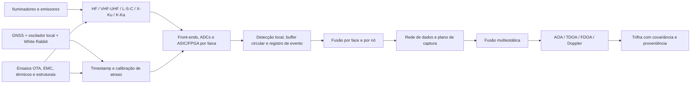

# RADOME — Sumário executivo e roadmap de pesquisa e engenharia

**Data de consolidação:** 8 de agosto de 2026
**Estado:** arquitetura conceitual; desempenho operacional ainda não demonstrado
**Documentos técnicos vigentes:** `projeto/radome-pt-br.tex` / `projeto/radome-pt-br.pdf` e `projeto/radome-en.tex` / `projeto/radome-en.pdf`

## 1. Síntese executiva

O RADOME propõe uma rede distribuída de estações passivas em sítios elevados para observar, caracterizar e localizar emissões eletromagnéticas. Cada nó combina uma estrutura geodésica, abertura híbrida multifaixa, recepção vetorial/polarimétrica, cadeias RF independentes, processamento local orientado a eventos, sincronização e calibração ponta a ponta. A fusão de múltiplos nós emprega AOA, TDOA e FDOA e, em cenários de radar passivo, canais separados de referência e vigilância.

A evolução documental corrigiu hipóteses iniciais fisicamente frágeis. A proposta atual não usa uma antena ou um LNB universal de HF a Ka, não equipara precisão de distribuição de tempo à coerência de fase em qualquer frequência e não promete localização operacional sem orçamento de enlace, geometria observável e calibração medida. O espectro é dividido em subsistemas; HF permanece um programa próprio, enquanto VHF/UHF é a primeira faixa recomendada para demonstrar a cadeia completa. O primeiro demonstrador não busca cobertura contínua: 323–470 MHz e 860–960 MHz são lacunas deliberadas, e UAT 978 MHz e ADS-B 1090ES usam uma abertura aeronáutica dedicada de 960–1215 MHz com caminhos receptores independentes. A ADR-012 reabriu o C2 para adotar 80 faces externas equiláteras de 2 m e células tetraédricas rasas de 0,75 m; suas paredes Faraday independentes deixam corredores para energia e fibras e preservam um núcleo interno livre de raio mínimo 2,2730 m. O corte e o apoio civil ainda precisam ser refeitos para essa geometria.

A principal contribuição pretendida é sistêmica: integrar abertura conformal/multifaixa, plataforma e radome calibrados, eletrônica distribuída, metrologia temporal, processamento de eventos e validação ambiental em uma única arquitetura reproduzível. Hoje essa contribuição está resolvida no nível de projeto e visualização 3D, não no nível de protótipo caracterizado.

Na montagem combinada VHF/UHF, o eixo estrutural e os booms são colineares com a normal externa de cada face triangular. Os elementos transversais das duas Yagis ocupam planos mutuamente ortogonais e o conjunto é girado 45° ao redor da normal em relação à base tangente local. As duas edições usam conjuntos gráficos localizados distintos, derivados dos mesmos mestres geométricos, com títulos, rótulos e chaves visuais em cada idioma.

A ADR-014 registra como inovação arquitetural candidata a combinação das Yagis externas com células piramidais receptoras individualmente blindadas e revestidas por absorvedor. Por não possuir iluminação nem varredura RF próprias, a estação tem assinatura de emissão necessariamente inferior à de um radar ativo equivalente; qualquer retorno associado à sua presença é espalhamento secundário de emissões externas. A hipótese adicional é evitar a perda do casco no caminho útil e reduzir auto-interferência, acoplamento, reradiação pela abertura e assinatura de espalhamento. Blindagem condutiva não equivale a absorção: a magnitude dessa redução adicional ainda exige simulação e ensaio de material, espessura, reflexão, absorção, padrões e RCS, sem alegação de invisibilidade absoluta.

A ADR-015 acrescenta duas hipóteses controladas. No eixo custo--desempenho, antenas externas, ausência de transmissor próprio e manutenção modular podem evitar parte da complexidade de um casco UWB e de uma cadeia ativa, mas suportes expostos, ambiente e multiplicação de canais podem compensar a economia; somente um modelo de ciclo de vida decidirá. No eixo de localização, atraso eco--referência define um elipsoide biestático, enquanto AOA, potência calibrada, Doppler/FDOA e polarização válida restringem probabilisticamente a solução. A recepção associada do mesmo eco por múltiplas antenas/faces e por outros radomes sincronizados acrescenta informação e reduz a incerteza nas direções observáveis não redundantes. O timestamping usa uma base temporal comum, centralmente referenciada e continuamente calibrada por técnicas simultâneas; a campanha experimental deve quantificar a redução, não estabelecer se o princípio existe.

A ADR-016 estabelece como premissa permanente que todos os sítios serão eventualmente localizados e cartografados por sensoriamento remoto óptico ou SAR. O projeto não depende de segredo geográfico nem de invisibilidade visual: sua sobrevivência sistêmica decorre de distribuição, redundância, segurança, isolamento e recuperação, enquanto a passividade limita a informação adversária sobre atividade e modo de operação mesmo quando o sítio é conhecido.

A ADR-017 transforma jamming em observável de interesse: energia radiada para degradar radares ativos também é uma emissão direta que as múltiplas faces e os radomes passivos podem interceptar, classificar e fundir por potência, espectro, AOA, timestamp e FDOA/Doppler. Maior energia radiada aumenta a observabilidade da fonte dentro da cobertura e faixa dinâmica do receptor; estados associados ao longo do tempo fornecem posição e vetor do centro de emissão. Jammers off-board, direcionais ou coerentes impedem identificar automaticamente essa fonte como a própria aeronave e constituem casos explícitos do protocolo `EXP-011`.

## 2. Mapa compacto do sistema

## 3. Linha de evolução documental

| Camada | Papel | Leitura crítica |
|---|---|---|
| `Radome2.pdf`, `RadomeBrasil.pdf` | Ideação inicial e diálogo técnico | Contêm afirmações excessivas, como cobertura universal por face, materiais com espessura fixada sem otimização e precisão temporal extrapolada. Servem como histórico, não como especificação. |
| `RADOME V3.md` e arquitetura eletrônica revisada | Geometria, hierarquia de aquisição, buffers, triggers e núcleo temporal | Estabelecem processamento distribuído e separam tempo do evento de tempo de transporte; vários números continuam parâmetros de projeto a dimensionar. |
| `Projeto_Radomes_Multifaixa_Revisado.md` | Primeira correção técnica integrada | Introduz particionamento espectral, aquisição vetorial, calibração e demonstrador de três nós. |
| `projeto_tecnico_radome_consolidado.md` e PDF completo | Consolidação intermediária | Integra arquitetura, infraestrutura, literatura, riscos e plano de prototipagem. |
| `projeto/radome-pt-br.tex`, `projeto/radome-en.tex` e capítulos por idioma | Duas edições autoritativas atuais | Incorporam a mesma arquitetura e conjuntos de figuras geometricamente equivalentes, localizados para cada idioma; incluem Yagis cruzadas VHF/UHF, base de concreto, cenas 3D, cenário aeronáutico e separação entre emissor direto e reflexão bistática. |
| `plano_diretor_complexo_vigilancia_alta_montanha.md` | Infraestrutura de implantação | Define energia, comunicações, térmica, EMC, logística e segurança; deve ser tratado como envelope conceitual até estudos civis e ambientais. |

## 4. Verificação da revisão de literatura via Consensus

O pacote `radome_antenna_literature_review/` contém revisão em Markdown e LaTeX, PDF compilado, 29 registros BibTeX provenientes da revisão via Consensus, script de build e relatório de validação. As cópias de `review.md`, `main.tex` e `references.bib` na raiz são byte a byte idênticas às do pacote. A bibliografia autoritativa do artigo em `projeto/references.bib` acrescenta fontes primárias fornecidas em `bibliography/`: Qamar, Salazar-Cerreno e Aboserwal (2020) para requisitos e validação de radomes UWB; Oh et al. (2026) para integração medida de antena UHF, parede metálica e radome GFRP; Ramanamurthy e Krishna (2016) para co-projeto eletromecânico sob pressão; Gould et al. (2006) para um demonstrador PCL multibanda que documenta vantagens e limites práticos do radar passivo; e as teses de Abotalebi (2023) e a prévia de Tandel (2024) para alternativas compactas de abertura larga. Oh et al. restringem a alegação de novidade: a candidata do RADOME não é a integração genérica de antena, isolamento metálico e cobertura, mas a combinação específica de Yagis externas ortogonais de faixas distintas, boom normal, célula piramidal blindada/absorvedora e rede passiva distribuída. `main.pdf` e `review.pdf` são o mesmo artefato. O relatório do pacote registra build completo, 29 entradas processadas, nenhuma citação indefinida e nenhuma advertência BibTeX.

A revisão cobre cinco eixos: antenas de banda larga e integração em faces; radomes/FSS; detecção, DF e localização passiva; identificação e anomalia de emissores; integração, calibração e validação. A lacuna central identificada — co-projeto e validação experimental ponta a ponta do conjunto antena–radome–receptor, incluindo distorções da plataforma — está alinhada com a arquitetura do projeto.

Limites que devem acompanhar qualquer uso acadêmico da revisão:

- é uma revisão narrativa baseada nos resultados retornados pelo Consensus, limitada a dez resultados por consulta, e não uma revisão sistemática PRISMA;
- contagens de citações são instantâneas e provisórias;
- metadados de afiliação não foram fornecidos e não devem ser inferidos;
- parte da literatura industrial ou de defesa pode ser proprietária, classificada ou mal indexada;
- os links do Consensus oferecem rastreabilidade da sessão, mas DOI, editora, volume, páginas e retratações devem ser conferidos em fontes primárias antes de submissão científica;
- a revisão sustenta a necessidade de integração e calibração, mas não valida por si só a geometria específica de Yagis cruzadas; ganho, banda, isolamento, polarização cruzada e estabilidade dessa solução exigem simulação e medição próprias;
- trabalhos de 2025–2026 e registros com resumo ou venue incompletos merecem auditoria bibliográfica prioritária.

## 5. Estado técnico e lacunas decisivas

| Domínio | Já definido | Falta demonstrar |
|---|---|---|
| Missão e arquitetura | Rede passiva, planos de controle/evento e captura, fusão hierárquica | Casos de uso priorizados, requisitos numerados e orçamento de desempenho |
| Antenas e radome | Particionamento por faixa, portas ortogonais, candidata de 80 faces externas de 2 m e células tetraédricas blindadas | Corte por módulos inteiros, hub e fundação; modelos EM, matriz de acoplamento, perda/atraso do casco e mapas OTA calibrados |
| RF e digital | Cadeias independentes; UAT/1090ES dedicados; baselines de 8 e 25 MS/s; vazão e captura bruta calculadas | Largura ocupada, clock/ENOB, faixa dinâmica, NF, IP3 e consumo após RFI e seleção de componentes |
| Tempo e calibração | GNSS, oscilador local, White Rabbit e calibração RF | Orçamento de incerteza, jitter, holdover e estabilidade de fase medidos |
| Algoritmos | AOA/TDOA/FDOA, cancelamento direto, CAF e três protocolos com evidência e métricas separadas | Dados reais, covariância consistente, CFAR e falso alarme medidos |
| Mecânica e ambiente | Casco, base, abertura de acesso, cargas internas e infraestrutura | FEA, vento/gelo/raio, térmica, vedação, manutenção, EMC e licenciamento |
| Evidência | Verificador tetraédrico, cena Blender de faces contíguas, triagem paramétrica de dados/horizonte e cenário nominal de 100 km | Tolerâncias/espessuras, orçamento de enlace e sítio, protótipo, ensaios reproduzíveis e campanha de campo com verdade-terreno |

### Subprojeto geoespacial vinculado ao artigo

`geoespacial/` é o subprojeto responsável por produzir a evidência reproduzível
para a seleção de sítios que será incorporada ao capítulo de infraestrutura e
validação das duas edições do artigo. Sua governança, seus entregáveis e o gate
de integração científica estão em `geoespacial/SUBPROJETO.md`; requisitos e
fases permanecem controlados, respectivamente, por
`REQUISITOS_GEOLOCALIZACAO.md` e `ROADMAP_GEOESPACIAL.md` naquele diretório.

Os marcos ativos são M2E — fechamento das camadas oficiais de emissões — e M3
— infraestrutura aeronáutica e estratégica. M2E prioriza o esquema
sítio--antena--emissão e a classificação do pacote geral Anatel, já baixado mas
ainda não integrado. M3 congela as 14 camadas DECEA selecionadas, das quais
VOR, NDB, DME e `navaids` já foram adquiridas, e reconcilia DECEA, ANAC e IBGE
BC250 com proveniência oficial. A matriz de lacunas está em
`geoespacial/CAMADAS_EMISSOES_OFICIAIS.md`.

O checkpoint operacional está em `geoespacial/STATUS_ATUAL.md`. O esquema
`sitio_fisico`--`antena`--`emissao` preserva as 3.284.526 portadoras SMP em
105.726 sítios e 282.623 proxies cadastrais de antena, sem perda. A etapa seguinte
auditou por streaming 16.876 registros de SARC, banda larga fixa e telefonia
fixa. SARC fornece 4.228 candidatos ativos a emissão; SCM fornece 1.850 Tx ativos;
STFC permanece sem parâmetros RF úteis. A próxima entrega migra somente os
registros com evidência suficiente ao esquema canônico. Essa migração produziu
6.078 emissões, 3.335 sítios e 3.995 proxies de antena, com partição sem perdas;
1.849 emissões SCM têm frequência, potência e altura presentes, enquanto SARC
continua incompleto para uso quantitativo. Trinta e seis testes passam e 22
produtos coincidiam byte a byte em duas execuções. A auditoria SLE preservou
119.058 linhas: 59.484 transmissões ativas e 59.484 recepções explícitas, com
118.490 registros de estações móveis que não podem ser promovidos automaticamente
a sítios fixos. SLP e Mosaico-STEL também foram auditados: são 10.580.778 e
10.817.122 linhas, respectivamente. O segundo é um consolidado que reproduz a
contagem do primeiro e agrega as contagens das demais bases já auditadas; não
pode ser somado como camada independente. Trinta e sete testes passam e 25
produtos coincidem byte a byte. O extrato seletivo isolou 100.410 registros de
enlace — 64.948 STFC, 35.424 SCM e 38 SMP — sem formar pontas. Trinta e oito
testes passam. As chaves brutas foram recuperadas para todas as linhas e a
equivalência foi confirmada sem divergências; 39 testes passam. O próximo gate
mede poder discriminante e testa reciprocidade e geometria. A partição resultou
em 340 candidatos recíprocos de duas coordenadas, 40 não recíprocos, 175 locais
e 373 ambíguos; nenhum enlace foi criado. Quarenta testes passam.
Dos 340 recíprocos, 328 apresentam caminho alinhado a até 15 graus, marcador
provisório cuja sensibilidade completa foi publicada; 12 não apresentam.
Quarenta e um testes passam. O próximo gate é terreno, curvatura e Fresnel.
A triagem Terrarium z8 classificou, em `k=1`, 218 rotas com 60% de Fresnel livre,
69 apenas com visada, 40 obstruídas e uma sem terreno; `k=4/3` também foi
publicado. Quarenta e três testes passam. O próximo gate substitui o MDE por
TOPODATA e verifica alturas físicas antes de qualquer aresta.
Para as 328 rotas foram selecionadas 154 folhas TOPODATA, cerca de 9,07 GiB;
uma folha requerida está ausente do índice oficial. Quarenta e quatro testes
passam. As 154 folhas foram então baixadas e validadas integralmente, totalizando
9.743.140.443 bytes reais, sem falhas e com SHA-256 individual; 46 testes passam.
O próximo gate extrai os GeoTIFFs e recalcula os perfis, preservando a folha
ausente como lacuna em vez de inventar dados.
Os 154 GeoTIFFs foram extraídos e indexados sem falhas, totalizando
12.013.983.756 bytes, com extensão, resolução e SHA-256 registrados; 48 testes
passam. O próximo gate recalcula e compara os perfis TOPODATA e Terrarium.
O TOPODATA resultou, em `k=1`, em 247 rotas com 60% de Fresnel livre, 59 apenas
com visada, 21 obstruídas e uma sem terreno; em `k=4/3`, 257/50/20/1. Os produtos
reproduziram byte a byte e 49 testes passam. Nenhuma aresta foi criada: o próximo
gate audita as alturas físicas, pois o máximo cadastral é otimista.
A auditoria por direção e frequência separou 993 caminhos recíprocos: 971 têm
uma altura cadastral em cada ponta, 12 são ambíguos e 10 incompletos. Dos 328
candidatos, 325 têm ao menos um caminho cadastral utilizável; três permanecem
bloqueados. Cinquenta e dois testes passam. O próximo gate recalcula TOPODATA
por caminho, ainda sujeito à posterior confirmação física.
O recálculo exato dos 971 caminhos resultou, em `k=1`, em 780 caminhos livres,
114 somente com visada, 69 obstruídos e 8 sem terreno. Entre 325 candidatos, a
melhor classe é 246/57/21/1. Cinquenta e cinco testes passam e os artefatos são
byte a byte reproduzíveis. O próximo gate confronta os ângulos de elevação.
A geometria vertical foi calculada para 963 caminhos; oito ficaram sem terreno.
No limiar provisório de 1°, 933 caminhos de 311 candidatos concordam nas duas
pontas em ambos os modelos de Terra efetiva. Cinquenta e nove testes passam.
O próximo gate consolida todas as condições numa pré-qualificação cadastral.
A consolidação retém, em `k=1`, 764 caminhos de 240 candidatos e, em `k=4/3`,
796 caminhos de 250 candidatos. Sessenta e dois testes passam; todos continuam
com pareamento não realizado. O próximo gate cria somente um grafo de hipóteses
cadastrais, separado de qualquer enlace fisicamente confirmado.
O GraphML de hipóteses contém 497 nós, 796 arestas cadastrais, 250 candidatos e
135 frequências; possui zero arestas operacionais. Em `k=1`/`k=4/3` há 237/247
componentes, com no máximo três nós. Sessenta e quatro testes passam. O próximo
gate vincula as pontas aos municípios e entidades antes da validação física.
O enriquecimento vinculou todas as 497 pontas a 365 municípios, sem códigos
ausentes ou conflitos. O grafo resultante possui 862 nós e 1.293 arestas — 796
hipóteses RF e 497 vínculos administrativos —, ainda com zero arestas operacionais.
Sessenta e seis testes passam. O próximo gate integra essas pontas ao grafo
unificado de municípios, emissores e candidatos a sítio.
O grafo unificado contém 123.846 nós e 119.158 registros de aresta: 5.571
municípios, 105.726 sítios SMP, 11.921 radiodifusores, 497 endpoints e 131
candidatos, sem colisões de atributo nem arestas operacionais. Sessenta e oito
testes passam. O próximo gate associa candidatos a municípios e contabiliza a
infraestrutura RF dentro de seus raios geométricos preliminares.

## 6. Roadmap orientado por gates

Os prazos abaixo são faixas de planejamento e só começam após disponibilidade de equipe, laboratório e orçamento. Fases podem se sobrepor quando não houver dependência física.

| Fase | Janela indicativa | Entregáveis mínimos | Gate de saída |
|---|---:|---|---|
| 0. Baseline e requisitos | 0–2 meses | ICD, requisitos rastreáveis, casos de uso, bandas e iluminadores prioritários, orçamento inicial de enlace/tempo/dados, matriz de riscos | Revisão SRR: cada desempenho tem métrica, método e responsável |
| 1. Modelagem e seleção | 2–6 meses | Simulação EM VHF/UHF e casco, cobertura/geometria de dois e três nós, modelo térmico/estrutural, mapa RFI preliminar, BOM de laboratório | PDR: solução VHF/UHF fecha margens simuladas e interfaces |
| 2. Cadeia de bancada | 4–9 meses | Duas polarizações, preseleção/LNA/ADC, buffer e trigger, injeção de calibração, timestamp comum e formato de registro | Perda, NF, linearidade, sincronismo e repetibilidade medidos contra requisitos |
| 3. Face e nó demonstrador | 8–14 meses | Face de 2 m ou mock-up equivalente, Yagis cruzadas, eletrônica blindada, OTA angular, térmica e EMC | CDR: manifold calibrado e estabilidade ambiental suficientes para campo |
| 4. Rede VHF/UHF de três nós | 12–20 meses | Nós sincronizados, baseline geodésico, emissor cooperativo, ADS-B direto e iluminadores UHF independentes, dataset versionado | Localização com covariância consistente e taxas de detecção/falso alarme publicadas |
| 5. Radar passivo e robustez | 18–26 meses | Referência/vigilância, cancelamento direto, CAF, Doppler/FDOA, alvos controlados; testes de canal, SNR, temperatura e engano | Separação experimental entre detecção direta e reflexão bistática; resultados reproduzíveis |
| 6. Expansão multifaixa | após gate VHF/UHF | Tiles L/S/C; depois X/Ku e K/Ka; programa HF paralelo com loops/dipolos/modos característicos | Cada nova faixa passa pelos mesmos gates RF, OTA, tempo, EMC e dados |
| 7. Piloto ambiental | após TRL do demonstrador | Nó instrumentado em ambiente representativo, energia e comunicações resilientes, manutenção e campanha sazonal | Disponibilidade, deriva de calibração e custo de operação sustentam expansão |

## 7. Próximas ações prioritárias

1. Executar M2E/M3 no subprojeto geoespacial: definir sítio–antena–emissão, classificar SLP/SLE/SARC/STEL, normalizar SMP/radiodifusão/VOR/NDB/DME e concluir a reconciliação ANAC–BC250–DECEA.
2. Fechar C3 com formas de onda e componentes selecionados, campanha RFI, orçamento em cascata de NF/IP3/faixa dinâmica e orçamento de enlace/sítio; preservar as lacunas deliberadas e a cadeia aeronáutica já aprovadas.
3. Criar uma matriz requisito–evidência com identificadores estáveis e ligar cada afirmação do artigo a simulação, ensaio ou referência.
4. Evoluir a triagem de aquisição já reproduzível para três orçamentos completos: enlace/SNR, sincronização-localização e dados/energia/térmica.
5. Auditar os 29 registros bibliográficos em fontes primárias, acrescentando DOI e corrigindo registros incompletos, sem apagar os links de proveniência do Consensus.
6. Simular a montagem Yagi VHF/UHF completa, incluindo boom comum, suporte, base, casco e acoplamento, antes de congelar dimensões.
7. Construir primeiro a cadeia coerente de bancada e o sistema de calibração; a casca completa só deve avançar após o gate metrológico.
8. Transformar os protocolos `EXP-006`–`EXP-008` em um plano de dataset de três nós: formatos, verdade-terreno independente, calibração, clima, RFI, versionamento e critérios de aceitação.
9. Fechar o C2 reaberto pela ADR-012: selecionar a borda inferior por módulos completos, dimensionar paredes, juntas e corredores com espessuras/folgas reais e recalcular a interface civil sem perder a continuidade da gaiola de Faraday.

## 8. Critério de sucesso do programa

O programa terá evidência convincente quando um terceiro puder reconstruir a configuração, repetir a calibração, processar o dataset e obter resultados compatíveis, com incerteza declarada, para detecção e localização VHF/UHF em três nós. Expansão espectral ou territorial antes desse marco aumenta custo e risco sem resolver a lacuna científica central.
