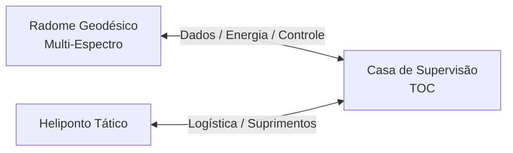
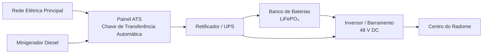
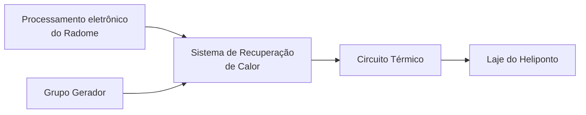
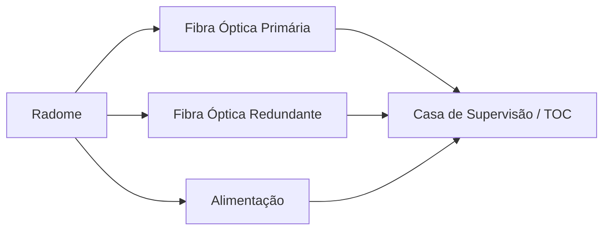
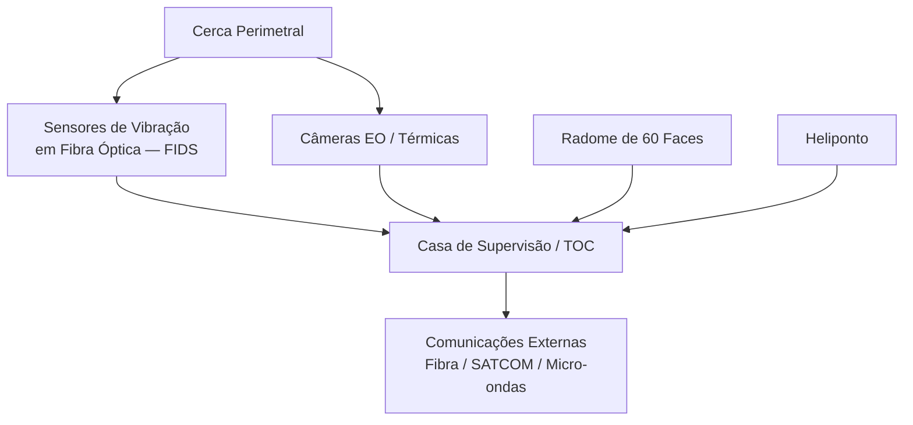
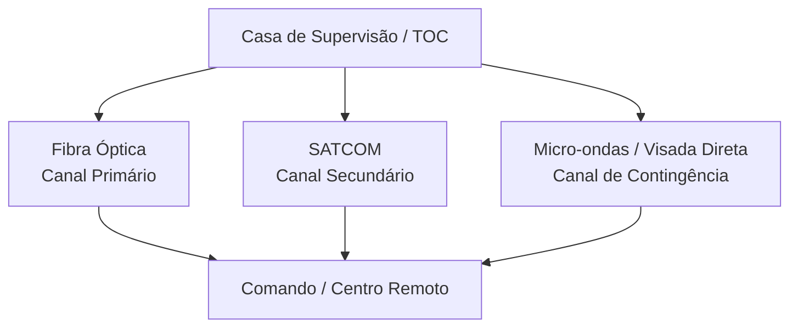
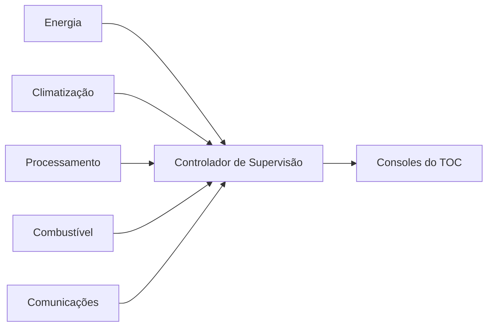
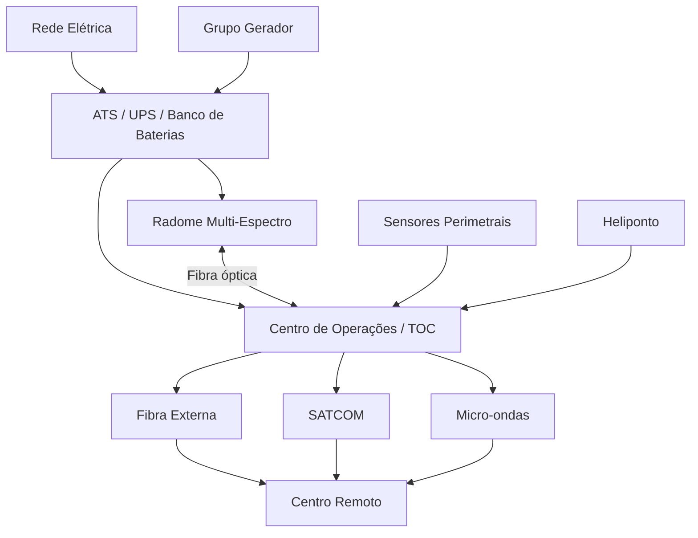

# Plano Diretor de Infraestrutura Tática
## Complexo de Vigilância Eletrônica C4ISR em Alta Montanha

> Documento estratégico consolidando a infraestrutura de defesa, energia, segurança perimetral e comunicações integradas para uma instalação de vigilância eletrônica em alta montanha.

---

## Sumário

1. [Visão Geral das Instalações Estratégicas](#1-visão-geral-das-instalações-estratégicas)
2. [Infraestrutura do Sistema de Energia Híbrido](#2-infraestrutura-do-sistema-de-energia-híbrido-alta-disponibilidade)
3. [Logística e Integração Térmica do Heliponto](#3-logística-e-integração-térmica-do-heliponto)
4. [Linha de Vida e Interconexão Estrutural](#4-linha-de-vida-e-interconexão-estrutural-radome---toc)
5. [Vigilância Eletrônica Avançada e Segurança Perimetral](#5-vigilância-eletrônica-avançada-e-segurança-perimetral)
6. [Múltiplos Meios de Comunicação Externa](#6-múltiplos-meios-de-comunicação-externa-redundância-c4isr)
7. [Protocolos de Segurança Lógica e Mitigação de Risco](#7-protocolos-de-segurança-lógica-e-mitigação-de-risco)
8. [Variáveis Próximas de Desenvolvimento](#8-variáveis-próximas-de-desenvolvimento)

---

## 1. Visão Geral das Instalações Estratégicas

Este documento estabelece as diretrizes de engenharia militar, segurança perimetral, resiliência energética e comunicações integradas para a implantação da **Base de Vigilância Espectral Avançada**.

O complexo é composto por três ativos críticos situados no topo de uma montanha isolada:

1. **Radome Geodésico Multi-Espectro**  
   Unidade de interceptação de sinais equipada com 60 faces piramidais independentes com processamento na borda (FFT).

2. **Casa de Supervisão — Centro de Operações Táticas (TOC)**  
   Núcleo fortificado de comando local, alojamento da guarnição e análise operacional.

3. **Heliponto Tático**  
   Linha de vida logística para reabastecimento de suprimentos, troca de tripulação e evacuação sob condições meteorológicas extremas.

### Visão geral do complexo

---

## 2. Infraestrutura do Sistema de Energia Híbrido (Alta Disponibilidade)

Para garantir a operação contínua e ininterrupta do radome sob falhas severas na rede elétrica principal, adota-se um ecossistema de energia em topologia de **Dupla Conversão Online**.

### Diagrama funcional

### 2.1 Painel ATS — Chave de Transferência Automática

Sistema automatizado que monitora a integridade da rede elétrica.

Em caso de queda ou oscilação fora dos parâmetros previstos, o ATS:

- emite ordem de partida ao minigerador;
- aguarda estabilização elétrica e mecânica;
- gerencia a comutação da carga;
- mantém a continuidade do sistema por meio da UPS durante a transição.

O tempo previsto de entrada do grupo gerador é inferior a 30 segundos.

### 2.2 Módulo UPS e banco LiFePO₄

A UPS preenche a janela temporal entre a perda da alimentação principal e a entrada do grupo gerador, garantindo **tempo de transferência zero** para as cargas críticas.

O banco de baterias emprega química **LiFePO₄ — Lítio Ferro Fosfato**, escolhida por:

- elevada estabilidade térmica;
- boa vida útil em ciclos;
- reduzida necessidade de manutenção;
- elevada segurança quando comparada a outras químicas de íons de lítio.

> **Nota de engenharia:** em ambientes de alta montanha, o banco deve possuir BMS e gerenciamento térmico adequado, especialmente para carregamento em temperaturas muito baixas.

### 2.3 Minigerador autônomo

Unidade movida a **óleo diesel de ciclo pesado**, destinada à sustentação das cargas críticas durante interrupções prolongadas da alimentação principal.

Requisitos previstos:

- cabine de proteção;
- isolamento acústico;
- sistema de pré-aquecimento para partidas em baixas temperaturas;
- filtragem elétrica;
- monitoramento remoto;
- integração ao ATS.

---

## 3. Logística e Integração Térmica do Heliponto

O heliponto é projetado como a principal via de abastecimento estratégico da base.

### 3.1 Segregação eletromagnética

O heliponto deverá ser posicionado de forma a minimizar interferências entre:

- aviônicos das aeronaves;
- radares de bordo;
- transceptores;
- receptores sensíveis do sistema de vigilância espectral.

A implantação deve considerar os setores de recepção e a geometria operacional do radome.

### 3.2 Recuperação térmica

O calor residual produzido pelo sistema de processamento eletrônico e pelo grupo gerador pode ser recuperado e encaminhado para cargas térmicas úteis.

Uma aplicação possível é a contribuição para o sistema de degelo do heliponto.

> O dimensionamento definitivo depende de balanço térmico considerando área da laje, temperatura ambiente, vento, precipitação e taxa de acumulação de neve ou gelo.

---

## 4. Linha de Vida e Interconexão Estrutural (Radome - TOC)

A integridade física dos dados processados e da energia distribuída depende de um canal protegido entre o radome e a Casa de Supervisão.

### 4.1 Trincheira técnica protegida

Os links troncais (*trunk lines*) devem utilizar infraestrutura subterrânea dedicada.

Elementos previstos:

- fibra óptica monomodo;
- alimentação elétrica;
- dutos independentes;
- caixas de inspeção;
- drenagem;
- proteção mecânica;
- caminhos redundantes quando possível.

### 4.2 Separação entre energia e dados

Internamente à infraestrutura técnica:

- fibras ópticas devem utilizar dutos próprios;
- circuitos de potência devem permanecer fisicamente separados;
- os pontos de entrada nas edificações devem contar com proteção mecânica e ambiental.

### Diagrama de interconexão

---

## 5. Vigilância Eletrônica Avançada e Segurança Perimetral

O perímetro da instalação deve ser monitorado utilizando tecnologias que reduzam a contribuição de emissões eletromagnéticas próximas aos sistemas receptores.

### Arquitetura de segurança e supervisão

### 5.1 Sensores de intrusão em fibra óptica — FIDS

A cerca perimetral pode ser monitorada por sistemas de detecção baseados em fibra óptica sensível a perturbações mecânicas.

O sistema permite identificar eventos como:

- vibração;
- tentativa de corte;
- escalada;
- movimentação próxima ao perímetro.

A fibra constitui um meio dielétrico e não necessita emitir sinais de radiofrequência ao longo do trecho sensoriado.

### 5.2 Sistemas optrônicos

O conjunto de vigilância pode combinar:

- câmeras térmicas;
- câmeras eletro-ópticas;
- sensores de baixa luminosidade;
- câmeras NIR quando aplicável.

Os sinais são encaminhados ao TOC para correlação e supervisão.

### 5.3 Compatibilidade eletromagnética do grupo gerador

O sistema elétrico deverá possuir medidas de compatibilidade eletromagnética, incluindo:

- aterramento adequado;
- filtragem de harmônicas;
- supressão de transientes;
- blindagem de subsistemas quando necessária;
- separação física das cargas sensíveis.

---

## 6. Múltiplos Meios de Comunicação Externa (Redundância C4ISR)

A informação gerada pelo sistema de vigilância pode utilizar uma arquitetura hierárquica de canais redundantes.

### Arquitetura de redundância

### 6.1 Fibra óptica — Canal primário

Características:

- alta capacidade;
- baixa latência;
- imunidade do meio óptico a interferências eletromagnéticas;
- possibilidade de rotas redundantes.

### 6.2 SATCOM — Canal secundário

Terminal satelital destinado a prover conectividade independente da infraestrutura terrestre.

A seleção de bandas, terminais e serviços dependerá da rede satelital disponível e das autorizações aplicáveis.

### 6.3 Enlace de micro-ondas — contingência

Um enlace direcional por visada direta pode funcionar como rota alternativa entre a instalação e um ponto remoto de comunicação.

A viabilidade depende de:

- topografia;
- distância;
- disponibilidade de visada;
- condições atmosféricas;
- licenciamento de frequência;
- orçamento de enlace.

---

## 7. Protocolos de Segurança Lógica e Mitigação de Risco

### 7.1 Proteção dos dados na borda

Os subsistemas de processamento podem aplicar proteção criptográfica aos dados antes de sua transmissão pelos enlaces internos.

A arquitetura deve contemplar:

- autenticação entre módulos;
- criptografia dos enlaces;
- gerenciamento seguro de chaves;
- registro de eventos;
- separação entre redes administrativas e redes de processamento.

### 7.2 Controle logístico automatizado

O sistema de supervisão deverá concentrar informações operacionais como:

- nível de combustível;
- estado do grupo gerador;
- estado de carga da UPS;
- temperatura dos módulos eletrônicos;
- estado dos sistemas de climatização;
- alarmes de infraestrutura;
- integridade dos links de comunicação.

### Fluxo de supervisão

---

## 8. Variáveis Próximas de Desenvolvimento

Os próximos níveis de engenharia podem detalhar:

- capacidade e autonomia do sistema de combustível;
- dimensionamento do banco de baterias;
- balanço energético completo;
- projeto térmico;
- dimensionamento do sistema de degelo;
- arquitetura física do backbone óptico;
- redundância dos processadores e enlaces;
- critérios de compatibilidade eletromagnética;
- dimensionamento estrutural das edificações;
- plano de manutenção;
- instrumentação e telemetria.

---

## Apêndice A — Visão Integrada do Complexo

---

## Compatibilidade dos diagramas

Os diagramas deste documento usam **Mermaid**.

Eles são renderizados nativamente ou por extensão em ferramentas como:

- GitHub;
- GitLab;
- Obsidian;
- Typora;
- VS Code com extensão Mermaid;
- vários geradores de documentação estática.

Em editores que não renderizem Mermaid, o código do diagrama continuará visível dentro dos blocos `mermaid`.

---

*Documento em formato Markdown.*
