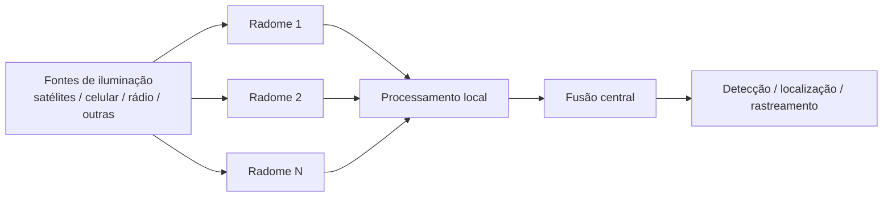
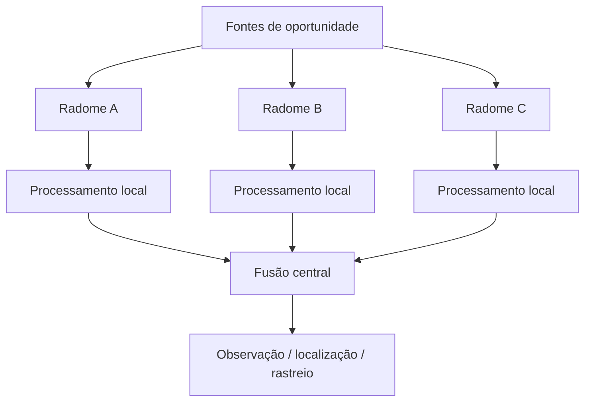

# Projeto Técnico Consolidado — Rede de Radomes Geodésicos Multiespectro para Vigilância Passiva e Geolocalização

## Versão 1.0

## Resumo executivo

Este documento consolida os principais aportes dos documentos disponíveis no workspace em uma proposta técnica integrada de sistema de vigilância eletromagnética passiva, baseada em uma rede de radomes geodésicos montados em bases militares no topo de montanhas ao longo do território brasileiro. A proposta considera a recepção distribuída de sinais emitidos por fontes naturais e artificiais, incluindo torres de celular, satélites, radiodifusoras, transmissores de telecomunicações e sinais de oportunidade, com posterior estimativa de direção, atraso, Doppler e posição por meio de fusão multiestática.

A arquitetura é concebida como um sistema coordenado, escalável e progressivo, com foco em:

- sensoriamento passivo e interoperabilidade espectral;
- recepção multibanda e polarimétrica;
- sincronização distribuída e calibração contínua;
- processamento local orientado a eventos;
- fusão central de observações para geolocalização e rastreamento.

A proposta não se limita a um radome isolado. Ela descreve uma infraestrutura de vigilância distribuída, com integração em rede, visão estratégica de defesa e de espectro, e uma base científica para futuras simulações, prototipagem e validação experimental.

---

# 1. Introdução

O projeto aqui consolidado trata de um sistema avançado de defesa aérea e de espectro eletromagnético, fundamentado em uma rede de radomes geodésicos montados em plataformas elevadas de alta montanha, estrategicamente distribuídas ao longo do território brasileiro.

A ideia central é substituir a noção de um único receptor de grande largura de banda por um ecossistema distribuído de sensores passivos, coordenados por sincronização precisa e processamento em rede. A superfície do radome não é tratada apenas como proteção mecânica, mas como uma plataforma eletromagnética funcional, capaz de receber sinais de múltiplas bandas e direções, com reconstrução espacial e temporal das emissões observadas.

A motivação operacional é dupla:

1. ampliar a capacidade de observação do espectro eletromagnético sem depender de transmissão ativa;
2. permitir a detecção e caracterização de emissões cuja fonte é desconhecida, desviada ou de oportunidade.

Em termos conceituais, o sistema opera com iluminação indireta fornecida por fontes externas conhecidas, como satélites, torres celulares, radiodifusoras e outros transmissores. Os desvios, diferenças de tempo, variações de frequência e ângulos de chegada podem ser combinados para produzir estimativas de posição e movimento de emissões ou alvos.

---

# 2. Visão geral do sistema

## 2.1 Conceito operacional

A arquitetura proposta consiste em:

- um conjunto de estações sensoriais distribuídas em sites montanhosos;
- radomes geodésicos com múltiplas aberturas funcionais;
- receptores multiespectro e polarimétricos;
- sincronização de tempo e frequência por rede óptica e referência de alta precisão;
- processamento local e fusão central.

O sistema é particularmente adequado para:

- vigilância passiva do espectro;
- radiogoniometria;
- localização multiestática;
- detecção de emissões anômalas;
- observação de sinais refletidos ou desviados;
- rastreamento de alvos aéreos, espaciais ou urbanos.

## 2.2 Arquitetura em alto nível

---

# 3. Arquitetura técnica proposta

## 3.1 Topologia da rede

A rede é organizada em camadas:

- camada local: vários nós em uma região de interesse;
- camada regional: clusters interconectados por comunicação robusta;
- camada nacional: integração estratégica para observação de grande escala.

Essa topologia permite combinar medidas de:

- ângulo de chegada (AoA);
- diferença de tempo de chegada (TDOA);
- diferença de frequência de chegada (FDOA);
- doppler e polarimetria.

## 3.2 Componentes principais

1. Radome geodésico
   - estrutura mecânica e eletromagnética;
   - múltiplas aberturas funcionais;
   - compatibilidade com diferentes bandas.

2. Módulos receptores
   - bandas HF/VHF/UHF;
   - bandas L/S/C;
   - bandas X/Ku/Ka;
   - canais dual-polarizados e calibrados.

3. Front-end e digitalização
   - conversão local;
   - FPGA e processamento na borda;
   - armazenamento circular de eventos.

4. Sincronização
   - referência temporal distribuída;
   - calibração contínua de atraso;
   - holdover local em caso de falha de enlace.

5. Centro de fusão
   - integração de observações;
   - estimativa de posição e trajetória;
   - geração de alertas e relatórios.

## 3.3 Diagrama funcional da arquitetura

---

# 4. Requisitos funcionais e especificações técnicas

## 4.1 Requisitos de alto nível

| Requisito | Meta proposta |
|---|---|
| Cobertura espectral | Recepção em múltiplas subfaixas, com particionamento funcional |
| Polarimetria | Dois canais ortogonais por subfaixa, com síntese digital |
| Sincronização | Timestamp distribuído com precisão compatível com geolocalização passiva |
| Resiliência | Operação degradada em caso de perda parcial de enlace |
| Calibração | Mapeamento contínuo do ganho, atraso e fase dos canais |
| Interoperabilidade | Integração com rede de dados, energia, segurança e telecomunicações |

## 4.2 Requisitos de arquitetura

- Cada nó deve possuir canais de referência e vigilância.
- As medidas devem incluir frequência, potência, instante de chegada, polarização, Doppler e qualidade.
- O sistema deve separar emissão direta, reflexão e interferência.
- O processamento deve ser distribuído, mas com fusão central explícita.
- O operador deve ter acesso a métricas de covariância e incerteza.

## 4.3 Especificação preliminar do radome

| Item | Especificação preliminar |
|---|---|
| Forma | Geodésica, com múltiplas faces funcionais |
| Escala | Protótipo de 4 a 6 m de diâmetro, escalável |
| Material | Estrutura dielétrica, com janelas funcionais para diferentes bandas |
| Aberturas | Separação entre setores de alta frequência e baixa frequência |
| Resiliência | Resistência a vento, umidade, salinidade, variação térmica |
| Integridade eletromagnética | Baixa perda, estabilidade angular e controle de acoplamento |

## 4.4 Especificação preliminar do sistema de recepção

| Subfaixa | Tecnologia recomendada |
|---|---|
| HF | Loops, dipolos cruzados e modos característicos |
| VHF/UHF | Arrays esparsos dual-pol |
| L/S/C | Sinuous, espiral, Vivaldi ou arrays conformais |
| X/Ku/Ka | Tiles phased-array dedicados, dual-pol e baixo perfil |

---

# 5. Revisão de literatura consolidada

## 5.1 Linhas principais da literatura

A literatura revisada aponta que o tema é tecnicamente viável, mas ainda fragmentado. Há avanço em três frentes principais:

1. Antenas de banda larga e arrays conformais;
2. Radomes funcionais e estruturas seletivas em frequência;
3. Localização passiva, direção de chegada e identificação de emissores.

As pesquisas mais relevantes evidenciam que:

- antenas conformais de banda larga são viáveis para recepção passiva;
- radomes funcionais podem ser projetados para preservar ou controlar transmissão em faixas específicas;
- a maior dificuldade não está apenas na antena, mas em todo o encadeamento: calibração, acoplamento, sincronização, propagação e estimativa de posição.

## 5.2 Contribuições principais da literatura

- Antenas UWB e conformais são adequadas para recepção de sinais de oportunidade.
- Arrays distribuídos e calibrados permitem estimar AoA, TDOA e FDOA.
- Métodos de fingerprinting e detecção aberta são úteis para classificar emissores desconhecidos.
- Radomes não devem ser tratados apenas como cobertura mecânica; eles afetam diretamente a função de transferência eletromagnética do sistema.

## 5.3 Lacunas existentes

A revisão mostra que a literatura ainda não oferece, de forma integrada, uma solução robusta que combine:

- radome conformal multi-faixas;
- recepção passiva distribuída;
- sincronização de alta precisão;
- calibração polarimétrica e angular;
- fusão multiestática com estimativa de incerteza;
- operação em campo em ambientes montanhosos e de alta variabilidade climática.

Essa lacuna é precisamente o ponto de inovação do projeto consolidado.

---

# 6. Aspectos inovadores do projeto

## 6.1 Inovação sistêmica

O projeto diferencia-se por integrar, em uma arquitetura única, os seguintes elementos:

- rede distribuída de radomes geodésicos;
- recepção multiestática e multiespectral;
- uso de fontes de oportunidade como iluminação indireta;
- processamento local orientado a eventos;
- calibração contínua e sincronização robusta;
- aplicação em cenários de montanha, defesa aérea e espectro eletromagnético.

## 6.2 Inovação técnica

A principal inovação técnica é tratar o radome como um sistema de observação eletromagnético, e não apenas como uma cobertura estrutural. Isso envolve:

- particionamento funcional das aberturas;
- coordenação entre geometria, material e comportamento eletromagnético;
- divisão por bandas e por tecnologias receptoras;
- uso de polarimetria vetorial e síntese digital.

## 6.3 Inovação científica e tecnológica

O projeto preenche uma lacuna entre:

- literature de antenas e radomes;
- literatura de detecção passiva e localização;
- literatura de sensoriamento de espectro e identificação de emissores.

A proposta avança para uma solução end-to-end, ainda que em fase conceitual.

---

# 7. Plano de prototipagem e validação

## 7.1 Etapas recomendadas

1. Simulação inicial do sistema
   - cobertura, geometria, orçamento de enlace e incerteza.

2. Protótipo de três nós
   - VHF/UHF, sincronização, referência e vigilância.

3. Validação de uma subfaixa funcional
   - L/S/C ou X/Ku conforme disponibilidade tecnológica.

4. Integração do radome completo
   - calibração, processamento e campanhas externas.

## 7.2 Critérios de validação

- estimativa de direção com qualidade mensurável;
- localização com covariância consistente;
- estabilidade térmica e eletromagnética;
- desempenho em cenários reais de campo;
- robustez a interferência e multipercurso.

---

# 8. Considerações de implementação

## 8.1 Infraestrutura de apoio

O sistema requer:

- energia redundante;
- comunicação óptica e de backup;
- climatização local;
- proteção contra interferência e descargas;
- integração com logística de montanha e segurança perimetral.

## 8.2 Riscos fundamentais

- complexidade de calibração entre nós;
- sensibilidade a salinidade, umidade e mudanças térmicas;
- limitação de geometria para certas faixas de frequência;
- dificuldade de separar sinais diretos, refletidos e espúrios.

Esses riscos não invalidam a proposta; ao contrário, definem as prioridades de projeto e validação.

---

# 9. Conclusão

A consolidação apresentada transforma o conceito inicial em uma proposta técnica coerente, com base em elementos já discutidos em documentos anteriores e em literatura especializada. A proposta avança de uma ideia conceitual para uma arquitetura verificável, com divisão em módulos, requisitos mensuráveis, plano de validação e foco em inovação sistêmica.

O projeto é relevante porque une, de forma integrada, os temas de:

- radome geodésico;
- sensoriamento passivo;
- espectro eletromagnético;
- geolocalização distribuída;
- defesa aérea e vigilância estratégica.

Em termos de avanço científico e tecnológico, ele preenche uma lacuna importante: a integração entre estruturas conformais, recepção multiespectral, sincronização distribuída e fusão de observações passivas em um ambiente de aplicação realista.
